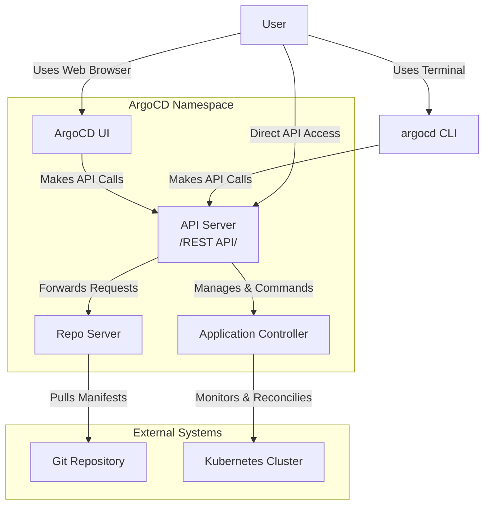

# Argo CD

## Definition
GitOps continuous delivery tool for Kubernetes. It automates application deployment and lifecycle management by syncing the live state of your applications with their desired state defined in a Git repository.

## GitOps vs. Classic CI/CD

| Aspect | Classic CI/CD | GitOps |
| :--- | :--- | :--- |
| **Paradigm** | Push-based (e.g., Jenkins, GitLab CI) | Pull-based (e.g., ArgoCD, Flux) |
| **Source of Truth** | CI/CD Pipeline Configuration | Git Repository |
| **Operation** | Tools push changes to servers | System continuously polls Git and applies changes |
| **Key Advantage** | Mature, widely adopted | Better control, security, and auditability |

## ArgoCD Architecture & Components

- **User Interfaces** : These are the entry points for humans and other systems (UI, CLI, REST API).

- **API Server** : The central hub and gateway for all communication. It receives commands from the UIs and orchestrates the other components.

- **Repo Server** : The "fetcher." Its only job is to connect to the Git repository, pull the latest manifests (YAML, Helm charts, customize files), and process them into raw Kubernetes resources.

- **Application Controller** : The "brain" or "reconciler." It continuously compares the desired state from the Repo Server with the actual, live state in the Kubernetes cluster and makes changes to align them.
