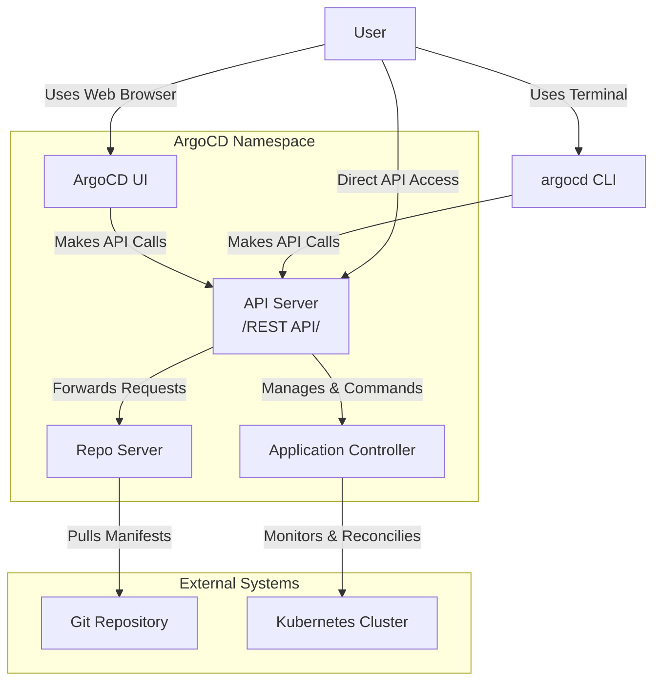

# Argo CD

## Definition
GitOps continuous delivery tool for Kubernetes. It automates application deployment and lifecycle management by syncing the live state of your applications with their desired state defined in a Git repository.


## GitOps vs. Classic CI/CD

| Aspect | Classic CI/CD | GitOps |
| :--- | :--- | :--- |
| **Paradigm** | Push-based (e.g., Jenkins, GitLab CI) | Pull-based (e.g., ArgoCD, Flux) |
| **Source of Truth** | CI/CD Pipeline Configuration | Git Repository |
| **Operation** | Tools push changes to servers | System continuously polls Git and applies changes |
| **Key Advantage** | Mature, widely adopted | Better control, security, and auditability |

## ArgoCD Architecture & Components



- **User Interfaces** : These are the entry points for humans and other systems (UI, CLI, REST API).

- **API Server** : The central hub and gateway for all communication. It receives commands from the UIs and orchestrates the other components.

- **Repo Server** : The "fetcher." Its only job is to connect to the Git repository, pull the latest manifests (YAML, Helm charts, customize files), and process them into raw Kubernetes resources.

- **Application Controller** : The "brain" or "reconciler." It continuously compares the desired state from the Repo Server with the actual, live state in the Kubernetes cluster and makes changes to align them.

  ---

### Quick Installation
```yaml
# Create namespace
kubectl create namespace argocd

# Install ArgoCD
kubectl apply -n argocd -f https://raw.githubusercontent.com/argoproj/argo-cd/stable/manifests/install.yaml

# Access via port-forward
kubectl port-forward svc/argocd-server -n argocd 8080:443
```

**Access UI at**: https://localhost:8080`

### Accessing ArgoCD UI & CLI

#### 1. Get Initial Admin Password
The default admin password is stored in a Kubernetes secret:
```bash
kubectl -n argocd get secret argocd-initial-admin-secret -o jsonpath="{.data.password}" | base64 -d && echo
```

#### 2. Install ArgoCD CLI
```
curl -sSL -o argocd https://github.com/argoproj/argo-cd/releases/latest/download/argocd-linux-amd64
chmod +x argocd
sudo mv argocd /usr/local/bin/
```
#### 3. Login via CLI
```yaml
argocd login <ARGOCD_SERVER_ADDRESS> --username admin --password <PASSWORD>
```
---

### Production Installation with Ingress & TLS
#### 1. Basic Installation
```yaml
kubectl create namespace argocd
kubectl apply -n argocd -f https://raw.githubusercontent.com/argoproj/argo-cd/stable/manifests/install.yaml
```
#### 2. Configure Service Type
**Default**: ArgoCD uses ClusterIP (internal cluster access only)  
**Goal**: Enable external access  
**Action**: Modify the `argocd-server` service configuration
```yaml
kubectl patch svc argocd-server -n argocd -p '{"spec": {"type": "ClusterIP"}}'
```
#### 3. Create Ingress Resource
```yaml
apiVersion: networking.k8s.io/v1
kind: Ingress
metadata:
  name: argocd-server-ingress
  namespace: argocd
  annotations:
    kubernetes.io/ingress.class: "nginx"
    nginx.ingress.kubernetes.io/backend-protocol: "HTTPS"
    nginx.ingress.kubernetes.io/ssl-redirect: "true"
spec:
  tls:
    - hosts:
        - argocd.your-domain.com
      secretName: argocd-tls-secret
  rules:
    - host: argocd.your-domain.com
      http:
        paths:
          - path: /
            pathType: Prefix
            backend:
              service:
                name: argocd-server
                port:
                  number: 443
```
#### 4. Create TLS Secret (if using manual certificates)
```yaml
kubectl create secret tls argocd-tls-secret \
  --cert=cert.crt \
  --key=cert.key \
  -n argocd
```
---
## Applications and Sync

### Application Definition
In ArgoCD, an **Application** defines what to deploy, from where, and how:
- **Source**: Git repository URL, path, and revision (branch/tag)
- **Destination**: Target cluster and namespace
- **Tooling**: Deployment method (plain YAML, Helm, Kustomize, etc.)

### Sync Operation
**Sync** means reconciling the desired state (in Git) with the live state (in cluster):
- **Manual Sync**: User-triggered deployment
- **Auto Sync**: Automatic deployment when Git changes
- **OutOfSync**: Status when live state differs from Git

### Sample Application YAML
```yaml
apiVersion: argoproj.io/v1alpha1
kind: Application
metadata:
  name: my-nginx
  namespace: argocd
spec:
  project: default
  source:
    repoURL: https://github.com/my-org/nginx-deploy
    targetRevision: HEAD
    path: manifests
  destination:
    server: https://kubernetes.default.svc
    namespace: default
  syncPolicy:
    automated:
      prune: true          
      selfHeal: true       
```
This application will:
- **Source**: Deploy contents from the `manifests` folder in the GitHub repository
- **Target**: Deploy to the `default` namespace in the Kubernetes cluster
- **Revision**: Use the latest commit (`HEAD`) from the repository
- **`prune: true`**: Automatically removes resources from the cluster if they are deleted from Git
- **`selfHeal: true`**: Automatically reverts any manual changes made directly in the cluster back to the state defined in Git
---
## Git Repository Configuration

- **Public Repos**: No credentials needed

- **Private Repos**: Require SSH keys or HTTPS credentials

### 1.SSH Connection (Recommended)
```bash
argocd repo add git@github.com:my-org/private-repo.git \
  --ssh-private-key-path ~/.ssh/id_rsa
```
### 2.HTTPS Connection
```bash
argocd repo add https://github.com/my-org/myrepo.git \
--username myuser \
--password mytoken
```
---
##  AppProject: Access Control in ArgoCD
AppProject is a resource in kubernetes that restricts what applications can do:

- **Namespace Restrictions**: Control which namespaces applications can deploy to
- **Git Repository Whitelisting**: Specify allowed source Git repositories
- **Cluster Access Management**: Define permitted target clusters
- **RBAC Configuration**: Set team-specific role-based access control rules

### Sample AppProject
```yaml
apiVersion: argoproj.io/v1alpha1
kind: AppProject
metadata:
  name: dev-team
  namespace: argocd
spec:
  sourceRepos:
    - https://github.com/my-org/dev-repos/*   # Only repo located under the `dev-repos/` are permitted.
  destinations:
    - namespace: dev
      server: https://kubernetes.default.svc
  namespaceResourceBlacklist:
    - group: ""
      kind: Secret                                 # Prevent Secret creation
```

