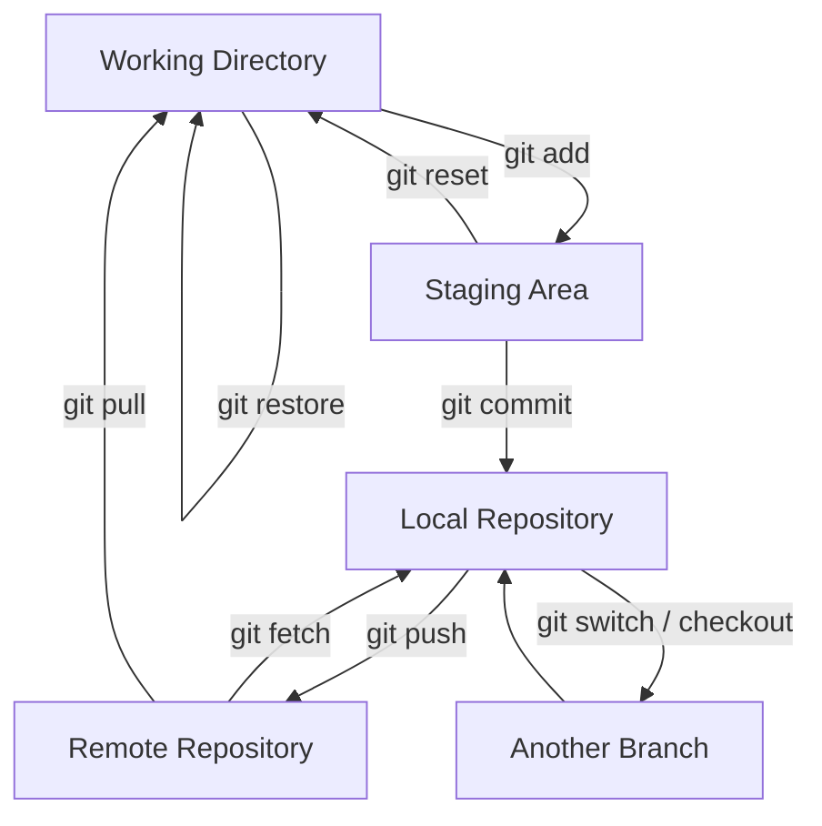

## Practical Git Commands Guide

**well-structured, practical, and GitHub-ready Git reference** focused on *what to use*, *when to use it*, and *why it matters*.

---

## 1. Git Workflow Overview (Big Picture)

This diagram shows how Git commands interact with different parts of Git.



---

## 2. Core Git Concepts (Must Know)

### Working Directory

**What it is:** Your project files on disk.

**Common commands:**

```bash
git status        # Show current changes
git diff          # Show unstaged differences
git restore file  # Discard local changes
```

---

### Staging Area

**What it is:** A preparation area for the next commit.

**Why it exists:** Allows partial commits and precise control.

```bash
git add file      # Stage a file
git add .         # Stage all changes
git add -p        # Stage interactively
git reset file    # Unstage a file
```

---

### Local Repository (Commits)

**What it is:** A database of committed snapshots.

```bash
git commit -m "msg"      # Create a commit
git commit --amend       # Modify last commit
git log --oneline        # View commit history
```

---

### Branches

**What they are:** Parallel lines of development.

```bash
git branch               # List branches
git branch feature-x     # Create branch
git branch -d feature-x  # Delete merged branch
```

---

### Switching Branches

**Purpose:** Move between branches or commits.

```bash
git switch main          # Switch branch (recommended)
git switch -c feature-x # Create + switch
git checkout main       # Legacy syntax
```

---
### Git Merge & Rebase
#### 1) Merge
Combines another branch into current branch while preserving branch history.
##### Fast-Forward Merge
**When:** target branch has no new commits.
- Happens when main has no new commits since branch was created.
```
A---B---C main
         \
          D---E feature
```
- After merge:
```
A---B---C---D---E main
```
```bash
git checkout main          # switch target branch
git merge feature          # merge branch (fast-forward if possible)
git merge --ff-only feature  # allow only fast-forward
```
##### Merge Commit (ORT strategy)
Git uses ORT strategy (since Git 2.34) to create a merge commit when histories diverge.
```
A---B---C main
     \
      D---E feature
```
- after merge:
```
A---B---C------M main
     \        /
      D------E
```
##### Squash Merge
- Combines all feature commits into one commit (no branch history kept).
```
git checkout main
git merge --squash feature
git commit -m "Add feature"
```
```
A---B---C---S main
```
- provide a clean history

**When To Use**

-   Shared branch → **merge**
-   Private branch → **rebase**
-   Clean PR → **squash**
---
#### 2) Rebase
- Moves feature commits on top of latest main.
- You want a clean, linear history
```
A---B---C main
     \
      D---E feature
```
After:
```
A---B---C---D'---E' feature
```
```
git checkout feature        # go to working branch
git rebase main             # replay commits on top
git rebase -i main          # Interactive rebase
```
---

### Undoing Changes

#### Restore (Files)

```bash
git restore file               # Discard file changes
git restore --staged file      # Unstage file
```

#### Reset (Commits)

```bash
git reset --soft HEAD~1        # Undo commit, keep staged
git reset --mixed HEAD~1       # Undo commit, keep unstaged
git reset --hard HEAD~1        # Undo commit and delete changes ⚠
```

#### Revert (Safe Undo)

```bash
git revert <commit>            # Create a new undo commit
```

---

## 3. Repository Setup

### git init

**Use when:** Starting a brand-new project.

```bash
git init                       # Initialize repo
git init my-project            # Create folder + repo
```

### git clone

**Use when:** Project already exists remotely.

```bash
git clone <url>                # Clone repo
git clone <url> dir-name       # Clone into folder
git clone --depth=1 <url>      # Shallow clone
```

---

## 4. Inspecting & Understanding History

```bash
git status                     # Current state
git log                        # Full history
git log --oneline --graph --all# Visual history
git show <commit>              # Inspect commit
git reflog                     # Recover lost commits
```

---

## 5. Working with Remotes (GitHub / GitLab)

```bash
git remote -v                  # Show remotes
git remote add origin <url>    # Add remote

git fetch                      # Download changes only
git pull                       # Fetch + merge
git pull --rebase              # Fetch + rebase
git push                       # Upload commits
git push -u origin main        # Set upstream
```

---

## 6. Temporary Work (Stash)
- saves changes that haven't been committed yet, allowing you to work on something else and come back to your changes later.
- Need to switch branches but not ready to commit

```bash
git stash                    # Stash uncommitted changes
git stash save "WIP: feature X"  # Stash with a descriptive message
git stash list                 # List stashes

git stash pop               # Apply last stash and remove it
git stash apply             # Apply last stash but keep it
git stash apply stash@{2}   # Apply specific stash

git stash drop stash@{1}    # Delete specific stash
git stash clear            # Delete all stashes
git stash branch new-branch # Create branch from stash
```

---

## 7. Advanced & Power Tools

### Configuration

```bash
git config --global user.name "Name"   # Set username
git config --global user.email "email" # Set email
git config --global alias.st status     # Create alias
```

---

### Tags (Releases)

**What it is:** Tags are named references to specific commits, usually used to mark releases or important milestones.

**When to use:** When creating versions like `v1.0`, `v2.1`, or marking stable releases.

````bash
git tag v1.0                   # Create a lightweight tag
git tag -a v1.0 -m "Release"  # Create an annotated tag with message
git tag                        # List all tags
git show v1.0                  # Show details of a tag
git push origin v1.0           # Push a single tag
git push --tags                # Push all tags
```bash
git tag v1.0                   # Lightweight tag
git tag -a v1.0 -m "Release"  # Annotated tag
git push --tags                # Push tags
````

---

### Clean Working Directory

**What it is:** Removes untracked files and directories from the working directory.

**When to use:** When your project directory is cluttered with build artifacts, temp files, or leftovers.

⚠ **Danger:** This permanently deletes files.

````bash
git clean -n                   # Preview what will be deleted (dry run)
git clean -f                   # Remove untracked files
git clean -fd                  # Remove untracked files and directories
```bash
git clean -n                   # Preview deletion
git clean -f                   # Delete untracked files
git clean -fd                  # Delete files + dirs
````

---

### Bisect (Find Bugs)

**What it is:** A binary search tool to identify the commit that introduced a bug.

**When to use:** When you know a bug exists but don’t know which commit caused it.

**How it Work:** It automatically checks out commits between a known "good" commit and a known "bad" commit, letting you test each one.
````bash
# 1. Start bisecting (assuming current HEAD is bad)
git bisect start
git bisect bad                 # Mark current commit as bad
git bisect good v1.0           # Mark known good commit/tag

# ----> Bisecting: 42 revisions left to test
# ----> Git checks out a middle commit for testing

# 2. Test the current commit
# Run your tests, check if bug exists
npm test                       # Example: run your test suite

# 3. Mark result
git bisect good                # If bug NOT present
git bisect bad                 # If bug IS present

# ---> Git will checkout the next commit to test
# ---> Repeat until bug is found

# 4. View results
git bisect log                 # Show bisect log
git bisect visualize           # See remaining commits graphically

# 5. When finished
git bisect reset               # End bisect, return to original branch

````
---

### Worktree (Multiple Branches)

**What it is:** Allows you to check out multiple branches at the same time in separate directories.

**When to use:** When working on multiple features or reviewing code without switching branches.

````bash
git worktree add ../feature feature-x   # Create new worktree for a branch
git worktree list                       # List active worktrees
git worktree remove ../feature          # Remove a worktree
```bash
git worktree add ../feature feature-x   # New worktree
git worktree list                       # List worktrees
git worktree remove ../feature          # Remove worktree
````

---

## 8. Recommended Daily Workflow

```bash
git status
git pull
git switch -c feature-x
# work
git add -p
git commit -m "Add feature x"
git push -u origin feature-x
```

---
