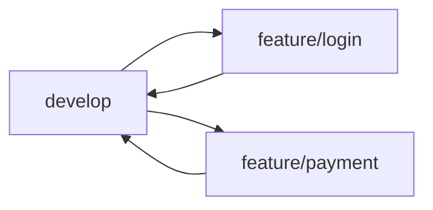
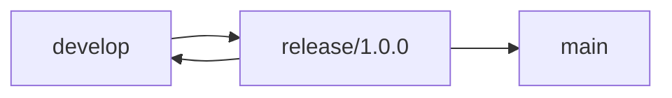
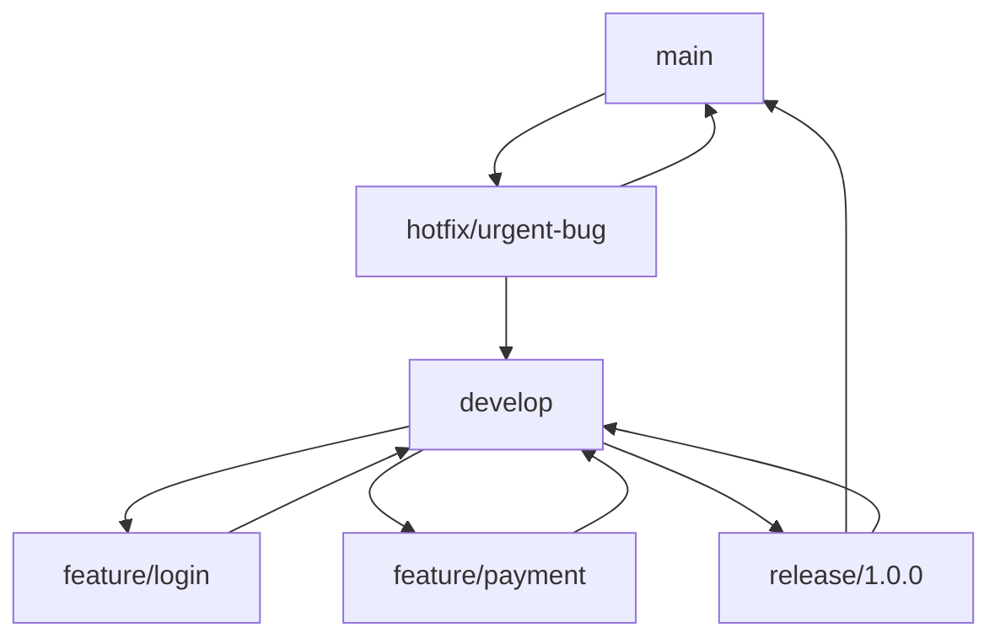

# Gitflow Workflow Guide

a structured Git branching model for managing features, releases, and hotfixes.

Gitflow defines specific roles for branches and standardizes how they interact. It is especially useful for teams with **planned release cycles**. ([Atlassian Gitflow Workflow](https://www.atlassian.com/git/tutorials/comparing-workflows/gitflow-workflow))

---

## Table of Contents

1. [What is Gitflow?](#what-is-gitflow)
2. [Gitflow Branch Workflows](#gitflow-branch-workflows)
3. [Core Branches & Their Purpose](#core-branches--their-purpose)
4. [Working with Feature Branches](#working-with-feature-branches)
5. [Working with Release Branches](#working-with-release-branches)
6. [Working with Hotfix Branches](#working-with-hotfix-branches)
7. [Example Gitflow Workflow](#example-gitflow-workflow)
8. [Summary](#summary)
9. [Tips & Best Practices](#tips--best-practices)

---

## What is Gitflow?

Gitflow is a **branching model** that assigns specific roles to branches and standardizes development and release workflows. It extends the Feature Branch Workflow, organizing development into structured phases. Gitflow does **not introduce new Git commands**, it provides a **standardized workflow using existing Git commands**.

**Use Gitflow when:**

* You have **scheduled release cycles**
* You want dedicated workflows for *features, releases, and hotfixes*
* You want **clear branch structure** and merge paths

---

## Gitflow Branch Workflows

### Feature Branch Workflow

Feature branches are used to develop new functionality for the upcoming release. They always branch off `develop` and are merged back into `develop` when the feature is complete.



### Release Branch Workflow

Release branches are created from `develop` when preparing a new production release. They allow for final bug fixes, documentation updates, and versioning without affecting ongoing feature development.



### Hotfix Branch Workflow

Hotfix branches are created from `main` to quickly patch production issues. After the fix, they merge back into both `main` and `develop`.


### Complete Gitflow Integration

This diagram shows how feature, release, and hotfix branches interact within the Gitflow workflow.



**Branch Descriptions:**

* `main` — Stores production-ready code and official releases.
* `develop` — Integration branch where all features are merged and tested.
* `feature/*` — Development of new functionality, branching from `develop`.
* `release/*` — Prepares code for production, including final fixes and versioning, branching from `develop`.
* `hotfix/*` — Quick patches for production issues, branching from `main` and merged into both `main` and `develop`.

---

## Core Branches & Their Purpose

### `main` (Production)

* Holds official production releases.
* Tagged with version numbers.

### `develop` (Integration)

* Main integration branch for features.
* All feature branches merge here.
* Typically created from `main` at project start.

---

## Working with Feature Branches

Feature branches are used to develop new functionality that will be merged into `develop`.

### Creating a Feature Branch

```bash
git checkout develop
git checkout -b feature/my-feature
```

Or with git-flow:

```bash
git flow feature start my-feature
```

### Completing a Feature Branch

```bash
git checkout develop
git merge feature/my-feature
git branch -d feature/my-feature
```

Or with git-flow:

```bash
git flow feature finish my-feature
```

---

## Working with Release Branches

Release branches allow you to prepare a new production release while new features continue on `develop`.

### Starting a Release

```bash
git checkout develop
git checkout -b release/1.0.0
```

Or with git-flow:

```bash
git flow release start 1.0.0
```

### Finishing a Release

```bash
git checkout main
git merge release/1.0.0
git tag -a 1.0.0 -m "Release 1.0.0"
git checkout develop
git merge release/1.0.0
git branch -d release/1.0.0
```

Or with git-flow:

```bash
git flow release finish 1.0.0
```

Push changes:

```bash
git push origin main develop --tags
```

---

## Working with Hotfix Branches

Hotfix branches allow you to patch production code quickly without waiting for the next release cycle.

### Starting a Hotfix

```bash
git checkout main
git checkout -b hotfix/critical-fix
```

Or with git-flow:

```bash
git flow hotfix start critical-fix
```

### Completing a Hotfix

```bash
git checkout main
git merge hotfix/critical-fix
git tag -a v1.0.1 -m "Hotfix 1.0.1"
git checkout develop
git merge hotfix/critical-fix
git branch -d hotfix/critical-fix
```

Or with git-flow:

```bash
git flow hotfix finish critical-fix
```

Push changes:

```bash
git push origin main develop --tags
```

---

## Example Gitflow Workflow

```bash
# Setup develop branch
git checkout main
git checkout -b develop
git push -u origin develop

# Feature work
git checkout develop
git checkout -b feature/login
# work...
git checkout develop
git merge feature/login

# Release work
git checkout develop
git checkout -b release/1.0.0
# polish for release...
git checkout main
git merge release/1.0.0
git tag -a 1.0.0 -m "Release 1.0.0"
git checkout develop
git merge release/1.0.0

# Hotfix
git checkout main
git checkout -b hotfix/security-patch
# fix...
git checkout main
git merge hotfix/security-patch
git checkout develop
git merge hotfix/security-patch
```

---

## Summary

Gitflow separates development into **feature**, **release**, and **hotfix** streams with clear merge paths:

* `develop` branches from `main`
* `feature/*` branches come from `develop`
* `release/*` branches come from `develop` and merge back into both `main` and `develop`
* `hotfix/*` branches come from `main` and merge into both `main` and `develop`

---

## Tips & Best Practices

* Use meaningful branch names (`feature/*`, `release/*`, `hotfix/*`)
* Keep feature branches small and focused
* Tag production releases on `main`
* Use pull requests for code review even if not using git-flow tooling

---

📌 *This Markdown file (`gitflow-workflow.md`) is fully GitHub-ready, with structured sections, commands, complete workflow diagrams, and branch descriptions.*
