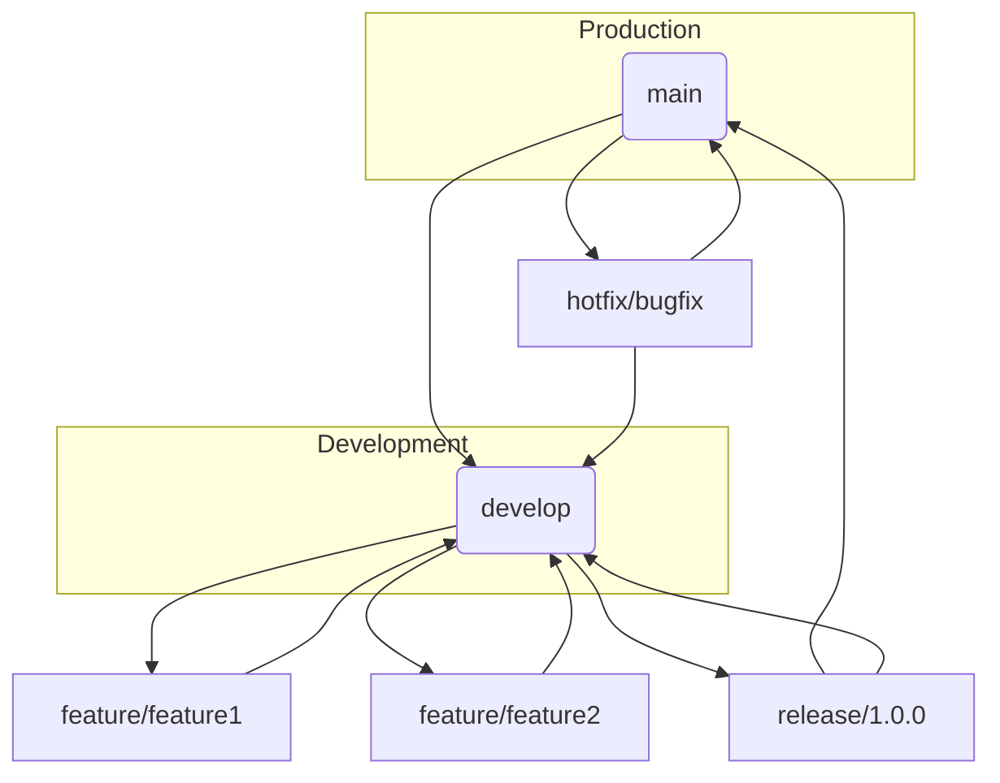

# Gitflow Workflow Guide

A complete **GitHub‑ready guide** to the Gitflow workflow — a structured Git branching model for managing features, releases, and hotfixes.

Gitflow is a popular workflow that defines specific roles for branches and standardizes how they interact. It’s especially useful for teams with **planned release cycles**. ([Atlassian](https://www.atlassian.com/git/tutorials/comparing-workflows/gitflow-workflow))

---

## Table of Contents

1. [What is Gitflow?](#what-is-gitflow)
2. [Gitflow Workflow Graph](#gitflow-workflow-graph)
3. [Core Branches & Their Purpose](#core-branches--their-purpose)
4. [Feature Branches](#feature-branches)
5. [Release Branches](#release-branches)
6. [Hotfix Branches](#hotfix-branches)
7. [Example Workflow](#example-workflow)
8. [Summary](#summary)
9. [Tips & Best Practices](#tips--best-practices)

---

## What is Gitflow?

Gitflow is a **branching model** that assigns specific roles to branches and defines how they should interact. It extends the Feature Branch Workflow, organizing development into structured phases. It does **not introduce new Git commands** — it simply standardizes how existing Git commands are used. ([Atlassian](https://www.atlassian.com/git/tutorials/comparing-workflows/gitflow-workflow))

**Use Gitflow when:**

* You have **scheduled release cycles**
* You want dedicated support for *features, releases, and hotfixes*
* You want clear structure in your branching strategy

---

## Gitflow Workflow Graph



**Explanation of branches:**

* `main` stores **production‑ready history**
* `develop` is the integration branch for features
* `feature/*` branches are created off `develop`
* `release/*` branches finalize code for production
* `hotfix/*` branches fix production issues

---

## Core Branches & Their Purpose

### `main` (Production)

* Contains official production release history
* Tagged with version numbers

### `develop` (Integration)

* Main integration branch
* All feature branches merge here
* Typically created from `main` at project start

---

## Feature Branches

Feature branches are used to develop new features for upcoming releases.

### Creating a Feature Branch

```bash
git checkout develop
git checkout -b feature/my-feature
```

**Alternative using git‑flow extension:**

```bash
git flow feature start my-feature
```

**Notes:**

* Branch always off of `develop`
* Never merge a feature directly into `main`

### Completing a Feature Branch

```bash
git checkout develop
git merge feature/my-feature
git branch -d feature/my-feature
```

Or with git‑flow:

```bash
git flow feature finish my-feature
```

---

## Release Branches

Release branches prepare the upcoming production release.

### Starting a Release

```bash
git checkout develop
git checkout -b release/1.0.0
```

Or with git‑flow:

```bash
git flow release start 1.0.0
```

**Purpose:**

* Finalize version number
* Fix bugs
* Update documentation

### Finishing a Release

```bash
git checkout main
git merge release/1.0.0
git tag -a 1.0.0 -m "Release 1.0.0"
git checkout develop
git merge release/1.0.0
git branch -d release/1.0.0
```

Or with git‑flow:

```bash
git flow release finish 1.0.0
```

Push changes:

```bash
git push origin main develop --tags
```

---

## Hotfix Branches

Hotfix branches are for urgent fixes in production.

### Starting a Hotfix

```bash
git checkout main
git checkout -b hotfix/critical-fix
```

Or with git‑flow:

```bash
git flow hotfix start critical-fix
```

### Completing a Hotfix

```bash
git checkout main
git merge hotfix/critical-fix
git tag -a v1.0.1 -m "Hotfix 1.0.1"
git checkout develop
git merge hotfix/critical-fix
git branch -d hotfix/critical-fix
```

Or with git‑flow:

```bash
git flow hotfix finish critical-fix
```

Push to remote:

```bash
git push origin main develop --tags
```

---

## Example Workflow

```bash
# Setup develop branch
git checkout main
git checkout -b develop
git push -u origin develop

# Feature work
git checkout develop
git checkout -b feature/login
# work...
git checkout develop
git merge feature/login

# Release work
git checkout develop
git checkout -b release/1.0.0
# polish for release...
git checkout main
git merge release/1.0.0
git tag -a 1.0.0 -m "Release 1.0.0"
git checkout develop
git merge release/1.0.0

# Hotfix
git checkout main
git checkout -b hotfix/security-patch
# fix...
git checkout main
git merge hotfix/security-patch
git checkout develop
git merge hotfix/security-patch
```

---

## Summary

Gitflow separates development into **feature**, **release**, and **hotfix** streams with clearly defined merge paths:

* `develop` is branched from `main`
* `feature/*` branches come from `develop`
* Features merge back into `develop` when ready
* `release/*` branches are created from `develop`
* After finishing, `release/*` merges into both `main` and `develop`
* `hotfix/*` branches come from `main`
* Hotfixes merge back into both `main` and `develop`

---

## Tips & Best Practices

* Use clear branch names (`feature/*`, `release/*`, `hotfix/*`)
* Keep feature branches short‑lived
* Tag production releases on `main`
* Use pull requests for code reviews even if not using git‑flow tooling

---

📌 *This document is fully GitHub‑ready as a single Markdown file (`gitflow-workflow.md`) including descriptions, commands, and workflow graphs.*
