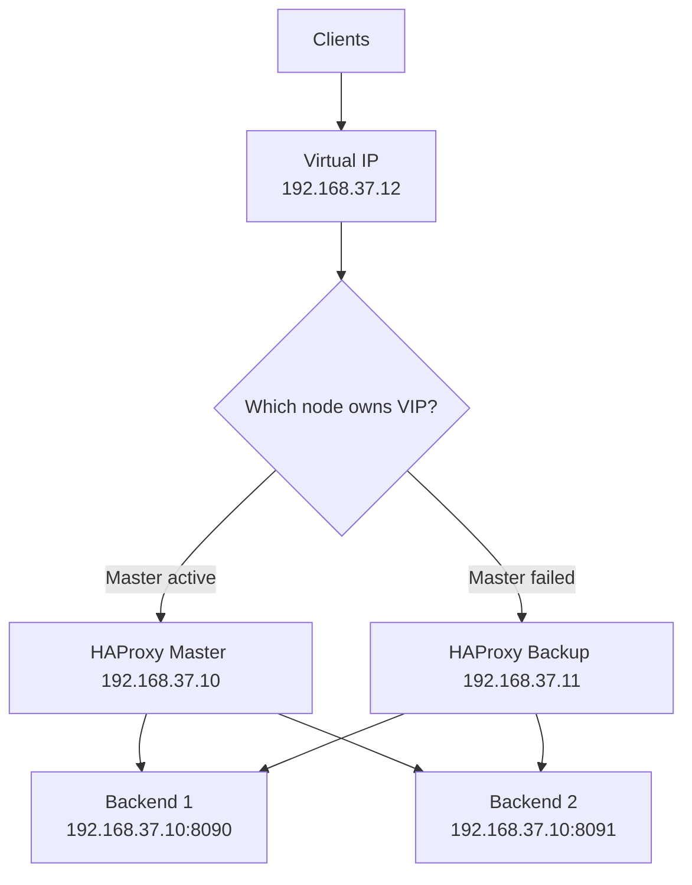

# HAProxy & Keepalived High Availability Setup

This document describes a simple **Master/Backup HA scenario** using **HAProxy** and **Keepalived** on **Rocky Linux 9.8**.

It is based on the following environment:

- **HAProxy**: `2.8.14-c23fe91`  
- **Keepalived**: `2.2.8`  
- **OS**: `Rocky Linux release 9.8 (Blue Onyx)`

---

## Architecture Overview

In this design:

- Clients connect to a **Virtual IP (VIP)**.
- **Keepalived** manages the VIP between two HAProxy nodes.
- The **Master** node owns the VIP during normal operation.
- If HAProxy fails on the Master, the VIP moves to the **Backup** node.
- HAProxy forwards requests to backend application servers.

###  Diagram



---

## Components Summary

### HAProxy
HAProxy is responsible for:

- Listening for client traffic
- Distributing traffic to backend servers
- Performing backend health checks
- Providing a statistics/monitoring page

### Keepalived
Keepalived is responsible for:

- Managing the Virtual IP (VIP)
- Detecting HAProxy service failure
- Moving the VIP from Master to Backup during failover
- Restoring service availability with minimal interruption

---

## Install Packages

```bash
sudo dnf install -y haproxy keepalived
```

---

## HAProxy Configuration

### Main Configuration

File: `/etc/haproxy/haproxy.cfg`

```cfg
global
    log /dev/log local0
    log /dev/log local1 notice
    maxconn 2000
    #user haproxy
    #group haproxy
    daemon
    stats socket /var/lib/haproxy/stats

defaults
    mode    http
    log     global
    option  httplog
    option  tcplog
    option  dontlognull
    timeout connect 5000ms
    timeout client  50000ms
    timeout server  50000ms
```

### Backend Application Configuration

File: `/etc/haproxy/conf.d/app1.cfg`

```cfg
frontend http_front
    bind *:80
    default_backend http_back

backend http_back
    balance roundrobin
    option httpchk HEAD /
    server web1 192.168.37.10:8090 check
    server web2 192.168.37.10:8091 check
```

### HAProxy Stats Page Configuration

File: `/etc/haproxy/conf.d/stat.cfg`

```cfg
listen Stats-Page
    bind *:5151
    mode http
    stats enable
    stats hide-version
    stats refresh 10s
    stats uri /
    stats show-legends
    stats show-node
    stats auth haproxy:haproxy
```

---

## HAProxy Stats Page Summary

The HAProxy Stats page is a lightweight built-in web interface used for monitoring HAProxy status.

It helps you quickly check:

- frontend and backend status
- server health check results
- session and connection counters
- traffic statistics
- active/down backend servers

> Example access: `http://<haproxy-node-ip>:5151/`

---

## Important HAProxy Properties

#### `global`
Defines process-level settings for HAProxy.

#### `log /dev/log local0`
Sends logs to syslog using facility `local0`.

#### `log /dev/log local1 notice`
Sends notice-level logs to syslog using facility `local1`.

#### `maxconn 2000`
Limits the maximum number of concurrent connections.

#### `daemon`
Runs HAProxy in the background.

#### `stats socket /var/lib/haproxy/stats`
Creates a Unix socket for administration and runtime statistics.

#### `defaults`
Defines default settings inherited by frontends/backends unless overridden.

#### `mode http`
Processes traffic as HTTP.

#### `option httplog`
Enables HTTP-specific log format.

#### `option tcplog`
Enables TCP log format. Usually more useful in TCP mode; here it is simply present in the notes.

#### `option dontlognull`
Avoids logging empty or aborted connections with no useful data.

#### `timeout connect 5000ms`
Maximum time to wait for connection to a backend server.

#### `timeout client 50000ms`
Maximum inactivity time for the client side.

#### `timeout server 50000ms`
Maximum inactivity time for the server side.

#### `frontend http_front`
Defines the client-facing listener.

#### `bind *:80`
Listens on TCP port `80` on all local interfaces.

#### `default_backend http_back`
Sends incoming traffic to backend `http_back`.

#### `backend http_back`
Defines the backend server pool.

#### `balance roundrobin`
Distributes requests evenly across backend servers in rotation.

#### `option httpchk HEAD /`
Uses an HTTP `HEAD /` request as a health check.

#### `server web1 ... check`
Defines a backend server and enables health checking for it.

#### `listen Stats-Page`
Creates a listener dedicated to the HAProxy Stats page.

#### `stats enable`
Enables the statistics web interface.

---

## SELinux Note

If SELinux is enforcing, allow HAProxy to connect to backend ports:

```bash
sudo setsebool -P haproxy_connect_any on
```

> `setenforce 0` is not recommended except for temporary troubleshooting.

---

## Test Backend Services

Example simple test backends:

### Backend 1

```bash
cd /opt/backend
cat /opt/backend/index.html
# backend1-192.168.37.10:8090
nohup python3 -m http.server 8090 -b 0.0.0.0 &
```

### Backend 2

```bash
cd /opt/backend2
cat /opt/backend2/index.html
# backend2-192.168.37.10:8091
nohup python3 -m http.server 8091 -b 0.0.0.0 &
```

---

## Validate and Start HAProxy

### Validate Configuration

```bash
haproxy -c -f /etc/haproxy/haproxy.cfg
```

### Restart and Check Service

```bash
sudo systemctl restart haproxy
sudo systemctl status haproxy
```

### Check Listening Ports

```bash
ss -ntlp | grep haproxy
```
---
### Security & Firewall Rules
Ensure the Virtual Router Redundancy Protocol (VRRP) and traffic ports are permitted:
```bash
# Allow VRRP traffic between nodes
sudo firewall-cmd --add-protocol=vrrp --permanent
# Allow HTTP traffic
sudo firewall-cmd --add-service=http --permanent
# Apply rules
sudo firewall-cmd --reload
```
---

## Keepalived Requirement for VIP Binding

HAProxy may need to bind to the VIP before that IP is locally attached.
To allow this behavior, enable non-local IP binding:

File: `/etc/sysctl.d/99-haproxy-vip.conf`

```conf
net.ipv4.ip_nonlocal_bind = 1
```

Apply it:

```bash
sudo sysctl -p /etc/sysctl.d/99-haproxy-vip.conf
```

---

## Keepalived Configuration

Keepalived monitors HAProxy using a script based on `systemctl is-active haproxy`.
If HAProxy becomes unhealthy on the Master, Keepalived reduces effective priority and failover can occur.

---

## Master Configuration

File: `/etc/keepalived/keepalived.conf`

```cfg
global_defs {
    router_id LB_PRIMARY
    enable_script_security
}

vrrp_script check_haproxy {
    script "/usr/bin/systemctl is-active haproxy"
    interval 2
    weight -20
    fall 3
    rise 2
    user root
}

vrrp_instance VI_1 {
    state MASTER
    interface ens160
    virtual_router_id 51
    priority 100
    advert_int 1

    authentication {
        auth_type PASS
        auth_pass haproxy
    }

    virtual_ipaddress {
        192.168.37.12/24
    }

    track_script {
        check_haproxy
    }
}
```

---

## Backup Configuration

File: `/etc/keepalived/keepalived.conf`

```cfg
global_defs {
    router_id LB_SECONDARY
    enable_script_security
}

vrrp_script check_haproxy {
    script "/usr/bin/systemctl is-active haproxy"
    interval 2
    weight -20
    fall 3
    rise 2
    user root
}

vrrp_instance VI_1 {
    state BACKUP
    interface ens160
    virtual_router_id 51
    priority 90
    advert_int 1

    authentication {
        auth_type PASS
        auth_pass haproxy
    }

    virtual_ipaddress {
        192.168.37.12/24
    }

    track_script {
        check_haproxy
    }
}
```

---

## Short Description of Important Keepalived Properties

#### `global_defs`
Global settings for the Keepalived process.

#### `router_id`
A local identifier for the node. Useful in logs and troubleshooting.

#### `enable_script_security`
Applies security checks for executed scripts.

#### `vrrp_script check_haproxy`
Defines a health-check script used by VRRP tracking.

#### `script "/usr/bin/systemctl is-active haproxy"`
Checks whether the HAProxy service is active.

#### `interval 2`
Runs the check every 2 seconds.

#### `weight -20`
Reduces VRRP priority by 20 when the script fails.

#### `fall 3`
Marks the script as failed after 3 consecutive failures.

#### `rise 2`
Marks the script as healthy after 2 consecutive successful checks.

#### `user root`
Runs the health-check script as root.

#### `vrrp_instance VI_1`
Defines one VRRP instance shared by both nodes.

#### `state MASTER` / `state BACKUP`
Sets the initial role of the node.

#### `interface ens160`
Network interface used for VRRP advertisements and VIP assignment.

#### `virtual_router_id 51`
Unique VRRP group ID. Must match on both nodes.

#### `priority 100` / `priority 90`
Determines which node is preferred to own the VIP. Higher value wins.

#### `advert_int 1`
Sends VRRP advertisements every 1 second.

#### `authentication`
Defines VRRP authentication settings.

#### `virtual_ipaddress`
Defines the floating IP address managed by Keepalived.

#### `track_script`
Associates the VRRP instance with the HAProxy health-check script.

---

## Validate and Start Keepalived

### Validate Configuration

```bash
sudo keepalived -t -l -f /etc/keepalived/keepalived.conf
```

### Restart and Check Service

```bash
sudo systemctl restart keepalived
sudo systemctl status keepalived
```

---

## Verification

### Check VIP on Primary

```bash
ip addr show ens160
```

You should see the VIP:

```text
192.168.37.12/24
```

listed on the active node.

---

## Failover Test

### 1. Stop HAProxy on Primary

```bash
sudo systemctl stop haproxy
```

### 2. Check VIP on Secondary

```bash
ip addr show ens160
```

The VIP should move to the Backup node.

### 3. Start HAProxy on Primary Again

```bash
sudo systemctl start haproxy
```

Because the primary has higher priority, the VIP should move back to the Master node.

---

## Quick Notes

- Both nodes must use the same `virtual_router_id`.
- `priority` on Master must be higher than Backup.
- The `auth_pass` must match on both nodes.
- Make sure the interface name is correct (`ens160` vs `eth0`).

---


