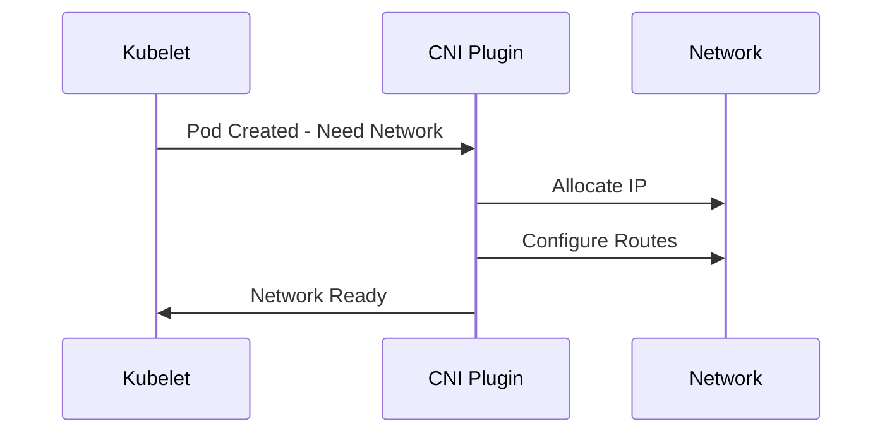
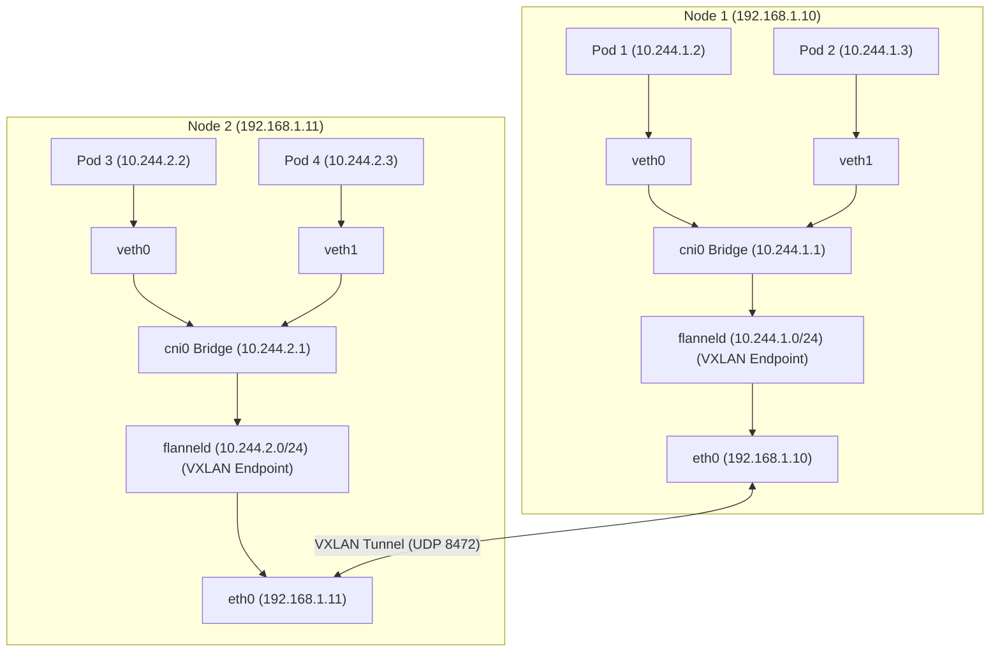

# Kubernetes CNI (Container Network Interface) Guide

## What is CNI?
CNI (Container Network Interface) is a plugin-based networking standard that enables Kubernetes to:
- Assign IP addresses to Pods
- Establish network connectivity between Pods, nodes, and external services
- Manage network policies and routing

## Why CNI Matters
- **Pod-to-Pod communication**: Across same node or different nodes
- **External connectivity**: Access to databases, APIs, and internet
- **Ingress traffic**: Handling user requests to applications
- **Network isolation**: Security between applications

## How CNI Works

### Popular CNI Plugins
| Plugin       | Best For            | Key Features                     | Performance | Network Policies |
|--------------|---------------------|----------------------------------|-------------|------------------|
| Flannel      | Small clusters      | Simple overlay network           | Good        | ❌ No            |
| Calico       | Security-focused    | BGP routing, NetworkPolicies     | Excellent   | ✅ Yes           |
| Cilium       | Advanced clusters   | eBPF-based, L7 policies          | Best        | ✅ Yes           |
| Weave        | Medium clusters     | Easy setup, encryption           | Good        | ✅ Yes           |
| Cloud CNIs   | Native cloud integration | AWS/Azure/GCP VPC integration | Excellent   | ✅ Yes           |

---
## Flannel in Kubernetes?

Flannel is one of the simplest and most popular CNI plugins for Kubernetes that provides networking between Pods across different nodes.

## Key Features
- Lightweight overlay network solution
- Simple Layer 3 network fabric
- Uses etcd or Kubernetes API for network state storage
- Supports multiple backends (VXLAN, host-gw, etc.)
- Automatically assigns subnets to each node
- No built-in network policies (unlike Calico/Cilium)

## How Flannel Works
1. Each node runs a `flanneld` daemon
2. Flannel allocates a subnet lease to each node
3. Creates virtual network interfaces on each host
4. Encapsulates traffic between nodes using configured backend

## Flannel Networking Schematic


### Communication flow (pod1 --> pod4)
```
[Pod1 (10.244.1.2)]-> veth0 ->[cni0 (10.244.1.1)]-> [flanneld]->[eth0 (192.168.1.10)]-> VXLAN encap ->
                                                                                                 
->  VXLAN decap ->[eth0 (192.168.1.11)]->[flanneld]->[cni0 (10.244.2.1)]-> veth1 ->[Pod4 (10.244.2.3)]
```
---
