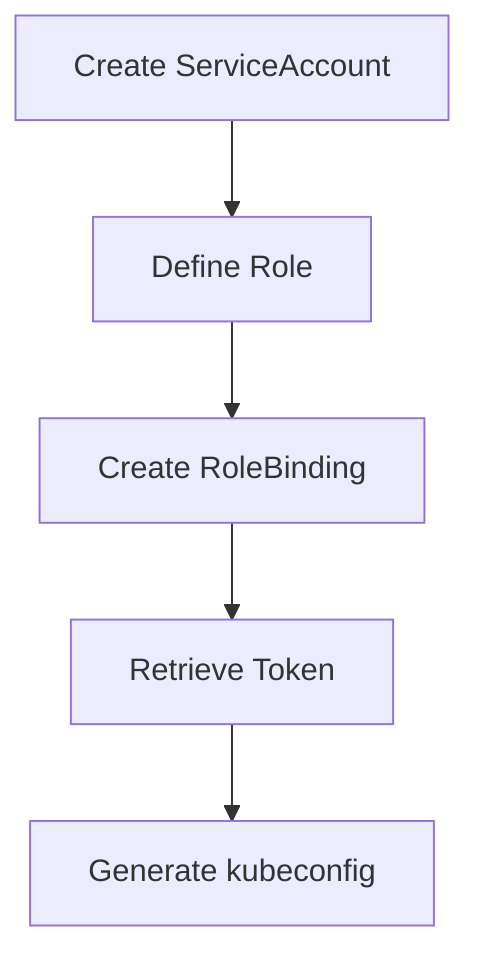

# Kubernetes RBAC (Role-Based Access Control) Guide

## Summary
RBAC is Kubernetes' authorization system that controls **who** (users/services) can **do what** (actions) on cluster resources. It enables granular permission management through roles and bindings.

## Key Benefits
- 🛡️ **Security**: Restrict access to only necessary resources
- 🏗️ **Organization**: Manage permissions at namespace or cluster level
- 🎚️ **Precision**: Control down to specific verbs (get, create, delete)

## Core Components
| Component | Scope | Description |
|-----------|-------|-------------|
| `Role` | Namespace | Permissions within a single namespace |
| `ClusterRole` | Cluster-wide | Permissions across all namespaces |
| `RoleBinding` | Namespace | Links role to user(s) in a namespace |
| `ClusterRoleBinding` | Cluster-wide | Links role to user(s) across cluster |

## Common Verbs  

- **Read:** `get`, `list`, `watch`  
- **Write:** `create`, `update`, `patch`, `delete`  
- **Admin:** `use`, `bind`, `escalate`  
## Scope Types

### 1. Namespace Scope
**For**: Team/project-specific permissions  
**Example**: Read-only access to pods in `team-a` namespace:
```yaml
apiVersion: rbac.authorization.k8s.io/v1
kind: Role
metadata:
  namespace: team-a
  name: pod-reader
rules:
- apiGroups: [""]
  resources: ["pods"]
  verbs: ["get", "list", "watch"]
```

### 2. Cluster Scope

**For**: Admin/global permissions
**Example**: Full cluster access:
```yaml
apiVersion: rbac.authorization.k8s.io/v1
kind: ClusterRole
metadata:
  name: super-admin
rules:
- apiGroups: ["*"]
  resources: ["*"]
  verbs: ["*"]
```
---
## Binding Examples
### 1.Namespace binding:
```yaml
apiVersion: rbac.authorization.k8s.io/v1
kind: RoleBinding
metadata:
  name: read-pods
  namespace: team-a
subjects:
- kind: User
  name: john
  apiGroup: rbac.authorization.k8s.io
roleRef:
  kind: Role
  name: pod-reader
  apiGroup: rbac.authorization.k8s.io
```
### 2.Cluster binding:
```yaml
apiVersion: rbac.authorization.k8s.io/v1
kind: ClusterRoleBinding
metadata:
  name: admin-all
subjects:
- kind: User
  name: admin
  apiGroup: rbac.authorization.k8s.io
roleRef:
  kind: ClusterRole
  name: super-admin
  apiGroup: rbac.authorization.k8s.io
```
---
# Practical Kubernetes RBAC Implementation
This Sample explains how to set up RBAC in Kubernetes using a ServiceAccount with the necessary permissions, and how to generate a kubeconfig file for accessing the cluster using this ServiceAccount.
## Scenario Overview
Grant "dani" user a read-only access to Pods in the `team-a` namespace.


### Step 1: Create ServiceAccount

Creates the identity for the user in Kubernetes:
```yaml
apiVersion: v1
kind: ServiceAccount
metadata:
  name: dani-sa
  namespace: team-a
secrets:
- name: secret-sa-dani
```
### Step2: Create Secret:
```
apiVersion: v1
kind: Secret
metadata:
  name: secret-sa-dani
  annotations:
    kubernetes.io/service-account.name: "dani-sa"
type: kubernetes.io/service-account-token
```
### Step 3: Define Role

Specifies the permitted actions (read-only for Pods):
```yaml
apiVersion: rbac.authorization.k8s.io/v1
kind: Role
metadata:
  namespace: team-a
  name: pod-reader
rules:
- apiGroups: [""]
  resources: ["pods"]
  verbs: ["get", "list", "watch"]
```
### Step 4: Create RoleBinding

Connects the Role to the ServiceAccount:
```yaml
apiVersion: rbac.authorization.k8s.io/v1
kind: RoleBinding
metadata:
  name: pod-reader-binding
  namespace: team-a
subjects:
- kind: ServiceAccount
  name: dani-sa
  namespace: team-a
roleRef:
  kind: Role
  name: pod-reader
  apiGroup: rbac.authorization.k8s.io
```
This configuration file creates a binding that:
- **Connects** the `pod-reader` Role 
- **To** the ServiceAccount `dani-sa` 
- **Within** the `team-a` namespace
  
### Step 5: Apply RBAC Resources
```yaml
kubectl apply -f role.yaml
kubectl apply -f rolebinding.yaml
kubectl apply -f serviceaccount.yaml
kubectl apply -f secret.yaml
``` 
### Step 6: Retrieve Authentication Token

Get the JWT token for the ServiceAccount:

```yaml
# List secrets
kubectl get secret -n team-a

# Extract token
kubectl describe secret dani-sa-token-abc123 -n team-a
```
### Step 7: Generate kubeconfig File

Create a client configuration file:

```yaml
apiVersion: v1
kind: Config
clusters:
- cluster:
    certificate-authority-data: <BASE64_CA_CERT>
    server: https://<API_SERVER_ADDRESS>:6443
  name: my-cluster
contexts:
- context:
    cluster: my-cluster
    namespace: team-a
    user: dani-user
  name: dani-context
current-context: dani-context
users:
- name: dani-user
  user:
    token: <SERVICEACCOUNT_TOKEN>
```
- ###  `Authentication Flow`

1. User presents `kubeconfig` with JWT token  
2. **Kubernetes API server:**  
   - Validates token signature  
   - Checks token expiration  
   - Verifies ServiceAccount exists  
   - Evaluates RBAC permissions  

### Step 8: Usage Instructions for User
1. Save the above configuration in a file named `config`
2. Instruct user dani to copy this file to `~/.kube/config`:

### Step9 : Verification Steps
```yaml
# dani will be able to view the list of Pods in the team-a namespace.
kubectl get pods -n team-a

# Test access
kubectl --kubeconfig=dani-config get pods -n team-a

# Verify permissions (should show only get/list/watch)
kubectl auth can-i --as=system:serviceaccount:team-a:dani-sa list pods -n team-a

```
