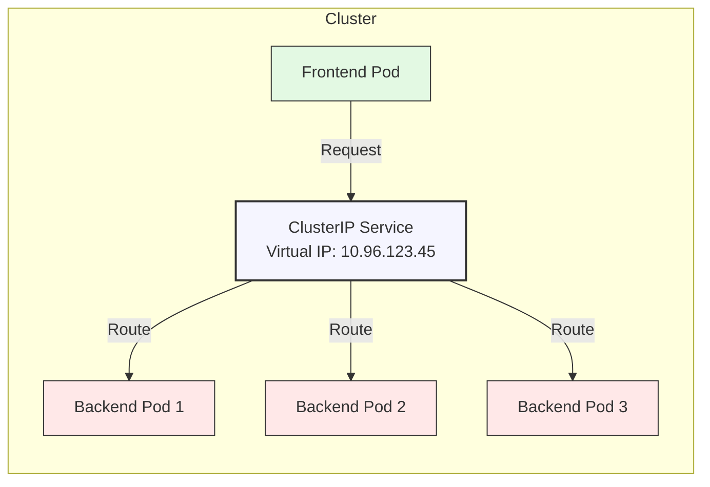
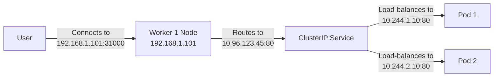
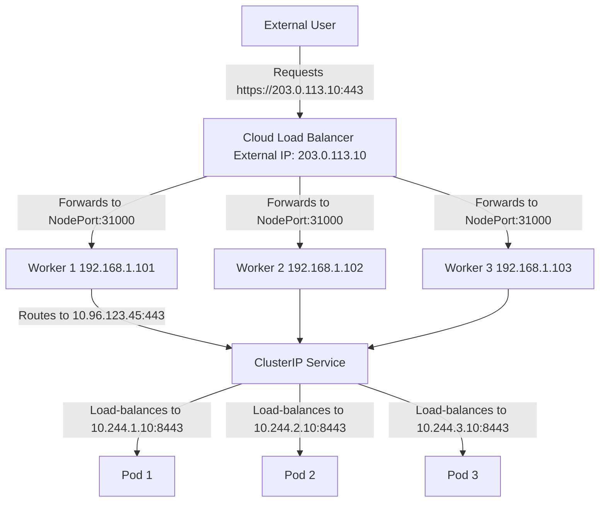
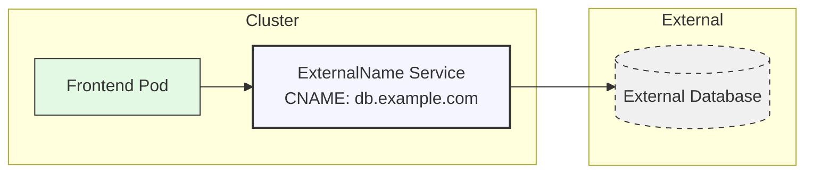
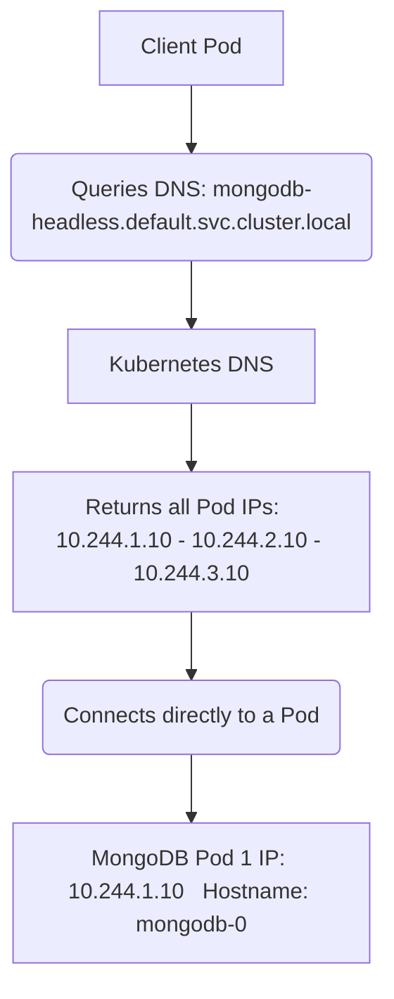
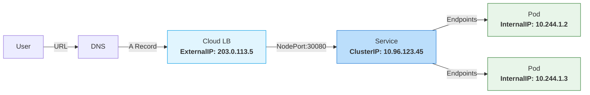

# Kubernetes Services: A Complete Illustrated Guide

## Understanding the Need for Services in Kubernetes

Let me start with a simple analogy: Imagine your Kubernetes cluster is like a busy restaurant. The Pods are your chefs - they come and go, change stations, and sometimes take breaks. The Service is like the restaurant's host - always at the front desk with a consistent point of contact, no matter which chefs are working in the kitchen.

### The Core Problem:

- Pods are ephemeral: They can be created, destroyed, or replaced at any time
- Pods get new IPs: Each time a Pod restarts, it gets a new IP address
- Direct Pod access is unreliable: You can't depend on a Pod's IP staying the same

### The Solution: Services

Services provide:

- Stable IP/DNS name that doesn't change
- Load balancing across multiple Pods
- Service discovery for other applications

## Service Types 

### 1. ClusterIP (Default)

- **Purpose:** Exposes the service internally within the cluster.
- **IP Assignment**: Gets a virtual IP (VIP) from the cluster's service CIDR range.
- **Accessible**: Only inside the cluster (Pods can communicate with it).



#### example yaml
```yaml
apiVersion: v1
kind: Service
metadata:
  name: backend-service
spec:
  selector:
    app: backend
  ports:
    - protocol: TCP
      port: 80
      targetPort: 8080
```
**Key Points:**

- Creates a virtual IP only accessible within the cluster  
- Uses labels to find matching Pods  
- Perfect for microservices communication  
- **Port:** The port the Service itself will listen on (80 in this case)  
- **TargetPort:** The port on the Pod containers that the Service will forward to (8080 in this case)
---
### 2. NodePort

- **Purpose**: Exposes the service on a static port on each Node’s IP.



### Key Takeaways

#### IPs Involved

- **Node IPs**:  
  `192.168.1.101`, `192.168.1.102`, `192.168.1.103` *(external access points)*
  
- **ClusterIP**:  
  `10.96.123.45` *(virtual IP, internal to Kubernetes)*
  
- **Pod IPs**:  
  `10.244.1.10`, `10.244.2.10` *(actual application endpoints)*

#### Master Node Role
- Does not handle NodePort traffic *(unless configured as a Worker)*

#### Important Note
- **Even if Pods are on 1 Node**:  
  Traffic to `Worker 3:31000` (which has no Pod) still works—Kubernetes routes it to Worker 1 or 2.

#### Access
- http://192.168.1.101:31000 , http://192.168.1.102:31000, http://192.168.1.103:31000

### example yaml
```yaml
apiVersion: v1
kind: Service
metadata:
  name: web-service
spec:
  type: NodePort
  selector:
    app: web
  ports:
    - port: 80
      targetPort: 80
      nodePort: 31000  # Exposed on all Nodes
```
**Key Points:**

- **Port Range:** Opens a static port (30000-32767) on all worker nodes  
- **Production Use:** Not recommended for production environments  
- **Use Case:** Primarily useful for testing and development  
- **Port (Service):** The Service's internal cluster IP port (`80`)  
- **TargetPort (Pods):** The port on the Pod containers (`80`)  
- **NodePort:** The external port exposed on each Node (`31000`) 
---
### 3.LoadBalancer

- **Purpose:** Exposes your application externally using a cloud provider’s load balancer (e.g., AWS ALB, GCP LB, Azure LB).

- Automatically assigns an external IP/DNS name.

- **Traffic Flow:**
    Internet → Cloud Load Balancer → NodePort → ClusterIP → Pod


#### example yaml
```yaml
apiVersion: v1
kind: Service
metadata:
  name: production-service
spec:
  type: LoadBalancer
  selector:
    app: production
  ports:
    - port: 443
      targetPort: 8443
```
#### Verify
```
kubectl get svc production-service
```
```
NAME                TYPE           CLUSTER-IP     EXTERNAL-IP      PORT(S)
production-service  LoadBalancer   10.96.123.45   203.0.113.10     443:31000/TCP
```
**Key Points:**

  - Automatically provisions cloud load balancer

  - Gets a public IP address

  - Ideal for production workloads

  - **Port**: The external port exposed by the load balancer (443)

  - **TargetPort**: The port on the Pod containers (8443) 

  - **Access:** 

      HTTPS Access: **curl -k https://203.0.113.10**

      Port Forwarding(debug) : 
      
      - **kubectl port-forward svc/production-service 9443:443**

      - `https://localhost:9443`
---
### Ingress and Nginx Ingress Controller

#### Nginx Ingress Controller
**Definition**:  
A specialized load balancer designed specifically for managing HTTP/HTTPS traffic that operates as a reverse proxy.

**Key Features**:
- Layer 7 (HTTP/HTTPS) load balancing
- SSL/TLS termination
- Host/path-based routing
- Rate limiting
- Custom routing rules
- `User → LoadBalancerIP → Ingress Pod → ClusterIP  → App Pod )`
   
```memraid
External User
       │ (Requests http://my-app.com/payment → 203.0.113.10)
       ↓
+---------------------+
| **Cloud Load Balancer** |
| IP: 203.0.113.10    |
+----------┬-----------+
           │ (Forwards to Ingress Controller Pod)
           ↓
+---------------------+
| **NGINX Ingress Controller** |
| Pod IP: 10.244.1.20 |
| Service: 10.96.111.222 |
+----------┬-----------+
           │ (Checks Ingress rules: "path=/payment → payment-service")
           ↓
+---------------------+
| **Payment Service** |
| ClusterIP: 10.96.222.333 |
+----------┬-----------+
           │ (Load-balances to Payment Pods)
           ↓
+---------------------+    +---------------------+
| **Payment Pod 1**   |    | **Payment Pod 2**   |
| IP: 10.244.4.10     |    | IP: 10.244.5.10     |
| Port: 8080          |    | Port: 8080          |
+---------------------+    +---------------------+
```
### ingress Class
IngressClass is like a "label" that tells Kubernetes which Ingress Controller should handle a particular Ingress resource.

**When do you need it?**
- You have **multiple Ingress Controllers** in your cluster (e.g., Nginx + Traefik)
- You want to **specify which controller** should manage certain Ingress rules

**How to define:**
```yaml
apiVersion: networking.k8s.io/v1
kind: IngressClass
metadata:
  name: nginx-ingress-class
spec:
  controller: k8s.io/ingress-nginx
```
---> Now You can use This ingress class(nginx-ingress-class) in ingress resource.

### Example ingrees rule YAML
```yaml
apiVersion: networking.k8s.io/v1
kind: Ingress
metadata:
  name: my-ingress
spec:
  rules:
  - host: "my-app.com"    # Replace with your domain
    http:
      paths:
      - path: /
        pathType: Prefix
        backend:
          service:
            name: my-app-service  # Main app
            port:
              number: 80
      - path: /payment
        pathType: Prefix
        backend:
          service:
            name: payment-service  # Payment app
            port:
              number: 80
```
### Debugging Tips
```
# Check Ingress status:
kubectl get ingress

# View NGINX logs:
kubectl logs -n ingress-nginx <nginx-controller-pod-name>
```
### Ingress vs. LoadBalancer vs. NodePort

| Feature         | Ingress                | LoadBalancer          | NodePort             |
|-----------------|------------------------|-----------------------|----------------------|
| **External IP** | Yes (via LB)           | Yes                   | No (use Node IPs)    |
| **Routing**     | URL/path-based         | Port-based            | Port-based           |
| **SSL**        | Yes (TLS termination)  | No (needs extra config)| No                   |
| **Use Case**   | Production web apps    | Production (non-HTTP) | Dev/Testing          |

---

### 4.ExternalName

### 4.ExternalName

is a Kubernetes `Service` type that redirects traffic to an **external DNS name** (outside the cluster) instead of internal Pods.  

#### Use Cases:  
- **Access External Services** when want to link apps inside Kubernetes to external services (e.g., APIs, databases outside the cluster).  
- **Simplify Configs** – No need to hardcode external IPs/DNS in apps.  
- **DNS-Based Routing** – Works with dynamic DNS, avoiding static IP dependencies.
  

    
#### example yaml
```yaml
apiVersion: v1
kind: Service
metadata:
  name: database-service
spec:
  type: ExternalName
  externalName: my-database.rds.amazonaws.com
```
**Key Points:**

- **DNS Operation:** Creates a DNS CNAME record (no IP mapping)
- **Service Configuration:**
  - No selectors (unlike ClusterIP/NodePort services)
  - No endpoint management
- **Migration Utility:** Excellent for transitioning services into Kubernetes
- **Port Handling:** Does not use port/targetPort (pure DNS redirection)
- **Traffic Flow:** Pods connect directly to external service after DNS resolution
- **Use Case:** Ideal for external databases/APIs while maintaining internal service discovery
----
### 5. Headless

A Headless Service is a special type of Kubernetes Service designed for direct Pod-to-Pod communication without load balancing or a stable ClusterIP. It's commonly used for stateful applications (e.g., databases) or when you need DNS-based service discovery for individual Pods.

#### Key Features of Headless Services

| Feature               | Description |
|-----------------------|-------------|
| **No ClusterIP**      | Set `clusterIP: None` to disable the virtual IP. |
| **Direct Pod DNS**    | Returns individual Pod IPs (not a single VIP). |
| **No Load Balancing** | Clients connect directly to Pods (bypassing kube-proxy). |
| **Use Cases**         | StatefulSets (e.g., MongoDB, Cassandra), peer discovery, custom DNS routing. |


#### Example YAML
```yaml
# mongodb-headless-service.yaml
apiVersion: v1
kind: Service
metadata:
  name: mongodb-headless
spec:
  clusterIP: None  # This makes it headless!
  selector:
    app: mongodb
  ports:
    - protocol: TCP
      port: 27017  # MongoDB default port
      targetPort: 27017
```
**Pod-Specific DNS:**
Each Pod in a StatefulSet gets a stable DNS name:

  -   `mongodb-0.mongodb-headless.default.svc.cluster.local` ----> 10.244.1.10
  -   `mongodb-1.mongodb-headless.default.svc.cluster.local` ----> 10.244.2.10
----
## Multi-Port Services in Kubernetes

Kubernetes Services can expose multiple ports to handle different protocols or endpoints. This is useful when a single Pod or Deployment listens on multiple ports (e.g., HTTP on `80` and metrics on `8080`).

### Supported Service Types with Multi-Port

- **ClusterIP** (default)  
  Exposes multiple ports internally within the cluster

- **NodePort**  
  Maps each service port to a high-port (30000-32767) on nodes

- **LoadBalancer**  
  Provisions cloud load balancer with multiple port mappings

```yaml
apiVersion: v1
kind: Service
metadata:
  name: multi-port-service
spec:
  type: ClusterIP
  selector:
    app: my-app
  ports:
    - name: http
      protocol: TCP
      port: 80          # Service port (ClusterIP)
      targetPort: 8080  # Pod port (app listens here)
    - name: metrics
      protocol: TCP
      port: 9090        # Service port
      targetPort: 3000  # Pod port (metrics endpoint)
```
----
## Kubernetes Service IPs Explained

### Internal IP (ClusterIP)

**Purpose:** Internal communication within a Kubernetes cluster

**Key Characteristics:**
- Private IP range (e.g., 10.244.0.0/16)
- Only accessible within the cluster
- Automatically assigned to Pods and Services
- Used for:
  - Pod-to-Pod communication
  - Internal service discovery
  - East-West traffic between microservices

### External IP

**Purpose:** Public access to cluster resources  

**Key Characteristics:** 

- **Publicly routable IP address**  
- **Typically assigned via**:  
  - LoadBalancer services (cloud-provided IP)  
  - NodePort services (Node IP + high port)  
  - Ingress controllers  
- **Enables**:  
  - Public web applications  
  - External API access  
  - Internet-facing services


```yaml
apiVersion: v1
kind: Service
metadata:
  name: nginx-service
spec:
  selector:
    app: nginx
  ports:
  - protocol: TCP
    port: 80
    targetPort: 80
  externalIPs:
  - 192.168.1.100
```
### How Works ?
When a request is made to an external IP (e.g., 192.168.1.100) on port 80:

- **Request Routing**:
  - Kubernetes directs the incoming request to the `nginx-service` Service
- **Load Balancing**:
  - The Service forwards the request to one of the available Nginx Pods (using built-in load balancing)

**How Internal and External IP Connect**

- Entry Point: External traffic hits the External IP
- Routing: kube-proxy directs to ClusterIP Service
- Load Balancing: Service distributes to Pods via Internal IPs
---

