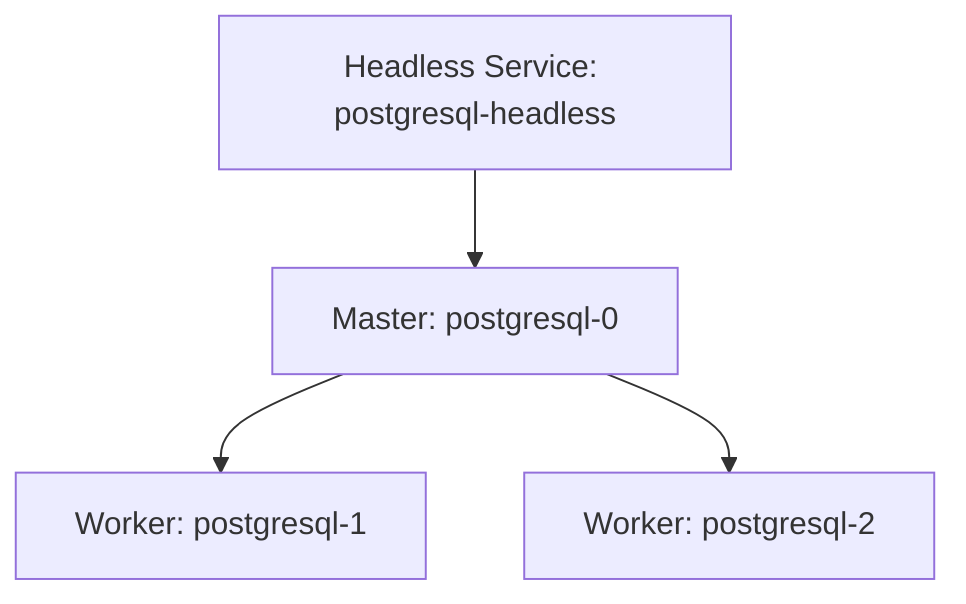
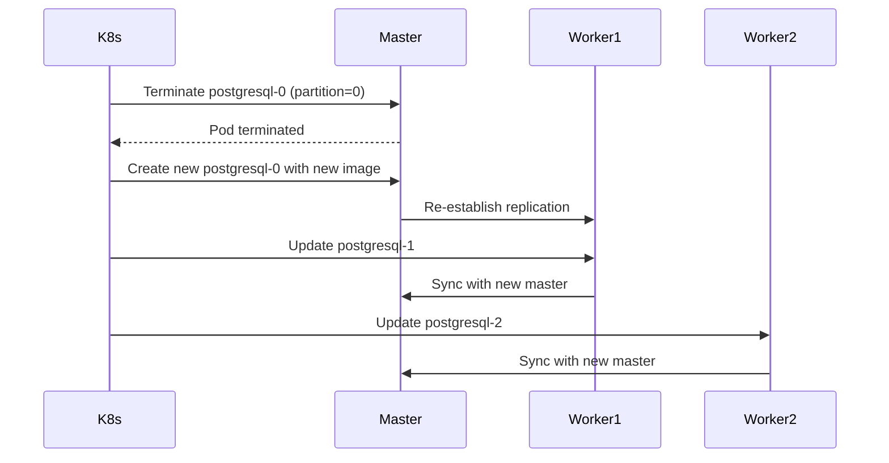

# StatefulSet in Kubernetes: A Technical Deep Dive

A StatefulSet is a Kubernetes workload API object designed to manage stateful applications (e.g., databases, messaging systems) that require persistent storage and stable network identities.

## Key Features

- **Stable Identifiers**: Pods are named sequentially (`pod-0`, `pod-1`, etc.)
- **Ordered Operations**: Pods are created/scaled/deleted in a fixed order
- **Data Persistence**: Uses PersistentVolumes (PVs) to retain data across pod rescheduling

## Limitations of StatefulSets

### 1. Dependency on Persistent Storage
- Each pod requires a dedicated PersistentVolumeClaim (PVC)

### 2. Sequential Operations
- Pods are created/deleted in order (`pod-0` → `pod-1` → ...)

### 3. No Built-in Load Balancing
- Traffic is not distributed across pods by default

### 4. Slow Scaling
- Scaling up requires provisioning new PVs
- *Optimization*: Use StorageClass with dynamic provisioning

---
## Headless Service

**Purpose**: Direct pod-to-pod communication (bypasses kube-proxy load balancing)

**Features**:
- No cluster IP; DNS records resolve to individual pod IPs
- Enables stateful application coordination (e.g., leader election, replication)

```yaml
apiVersion: v1
kind: Service
metadata:
  name: postgresql-headless
spec:
  clusterIP: None
  selector:
    app: postgresql
  ports:
    - port: 5432

```
---

## StatefulSet Configuration

### Pod Management Policies

| Policy               | Behavior                                      | Use Case                              |
|----------------------|-----------------------------------------------|---------------------------------------|
| `OrderedReady` (default) | Pods created/deleted sequentially (e.g., `pod-0` → `pod-1`) | Databases requiring ordered scaling |
| `Parallel`           | Pods created/deleted concurrently             | Stateless apps with PVs              |

### Update Strategies

#### 1. RollingUpdate
- Updates pods sequentially (controlled by `partition`)
- **Example**: `partition=2` updates only pods with index ≥2 (`pod-2`, `pod-3`, etc.)

```yaml
updateStrategy:
  type: RollingUpdate
  rollingUpdate:
    partition: 2  # Only updates pod-2, pod-3, ...
```

#### 2. OnDelete

- Updates occur only when pods are manually deleted
- **Risk**: Potential downtime

```yaml
updateStrategy:
  type: OnDelete
```
---
## PostgreSQL HA Cluster on Kubernetes (StatefulSet)

### Architecture Overview


### Key Design Choices

### Persistence

- Each pod mounts a unique PV (e.g., `postgresql-0` → `pv-postgresql-0`).
  
  **Example:**
  ```yaml
  volumeClaimTemplates:
  - metadata:
      name: postgresql-data
    spec:
      storageClassName: "ssd"
      accessModes: [ "ReadWriteOnce" ]
      resources:
        requests:
          storage: 10Gi
  ```

### Updates

- Master (`postgresql-0`) is updated before workers to avoid data inconsistency.

### Why Not Deployment?

- **Recreate strategy** causes downtime
- **RollingUpdate** cannot enforce master-first ordering
---
## 1. NFS PersistentVolume (Manual Provisioning)

```yaml
# pv-nfs.yaml
apiVersion: v1
kind: PersistentVolume
metadata:
  name: pv-postgres-0
spec:
  capacity:
    storage: 10Gi
  volumeMode: Filesystem
  accessModes:
    - ReadWriteOnce
  persistentVolumeReclaimPolicy: Retain
  nfs:
    server: your-nfs-server-ip
    path: "/var/lib/postgresql/9.5/master"

---
apiVersion: v1
kind: PersistentVolume
metadata:
  name: pv-postgres-1
spec:
  capacity:
    storage: 10Gi
  nfs:
    server: your-nfs-server-ip
    path: "/var/lib/postgresql/9.5/worker1"
# Repeat for pv-postgres-2 and pv-postgres-3
```
## 2.Headless Service
```yaml
# postgresql-hl.yaml
apiVersion: v1
kind: Service
metadata:
  name: postgresql-hl
spec:
  clusterIP: None
  selector:
    app: postgresql
  ports:
    - port: 5432
```
## 3.StatefulSet
```yaml
# postgresql-ss.yaml
apiVersion: apps/v1
kind: StatefulSet
metadata:
  name: postgresql
spec:
  serviceName: "postgresql-hl"
  replicas: 3  # 1 master + 2 workers
  podManagementPolicy: OrderedReady
  
  template:
    metadata:
      labels:
        app: postgresql
    spec:
      containers:
      - name: postgresql
        image: postgres:9.5
        env:
        - name: POSTGRES_PASSWORD
          value: "yourpassword"
        - name: PGDATA
          value: "/var/lib/postgresql/9.5/data"
        ports:
        - containerPort: 5432
        volumeMounts:
        - name: postgresql-data
          mountPath: "/var/lib/postgresql/9.5/data"

  volumeClaimTemplates:
  - metadata:
      name: postgresql-data
    spec:
      accessModes: [ "ReadWriteOnce" ]
      resources:
        requests:
          storage: 10Gi
      volumeName: pv-postgres-{0,1,2}  # Matches PV names
```
---
## Deployment Command

### Apply configurations
```bash
kubectl apply -f pv-nfs.yaml
kubectl apply -f postgresql-hl.yaml
kubectl apply -f postgresql-ss.yaml
```

### Verify
```bash
kubectl get pods -l app=postgresql -w
kubectl get pv
kubectl get pvc
```
---
## Key Design Points

### Storage Design

| Component    | Path                              | Purpose            |
|--------------|-----------------------------------|--------------------|
| Master PV    | `/var/lib/postgresql/9.5/master`  | Master database    |
| Worker PVs   | `/var/lib/postgresql/9.5/workerX` | Worker replicas    |

### Pod Identity Management

#### Fixed Roles
- `postgresql-0`: Permanent master
- Workers discover master via DNS: `postgresql-0.postgresql-hl`

#### Stable Network Identity
- Pod names persist across reschedules
- DNS format: `<pod>.<service>.namespace.svc.cluster.local`

### Update Strategy
1. Master pod updates first
2. Workers update sequentially (1 → 2)
3. Health checks prevent updates during replication


### Advantages
- **Data Safety**: NFS backend provides cross-node accessibility
- **High Availability**: Master-worker replication
- **Consistency**: Ordered updates prevent split-brain scenarios
