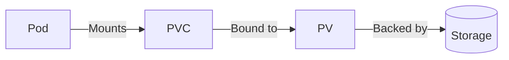

# Kubernetes Storage: Overview and Types

## What is Kubernetes Storage?
Storage in Kubernetes provides persistent data storage for applications running in pods.

## Why Use Kubernetes Storage?
- **Data persistence**: Preserve data across pod restarts
- **Data sharing**: Allow multiple pods to access the same data
- **Flexibility**: Move data between nodes/servers easily

## Storage Types


| Type               | Purpose                          | Use Case                          | Pros                              | Cons                              |
|--------------------|----------------------------------|-----------------------------------|-----------------------------------|-----------------------------------|
| **EmptyDir**       | Temporary pod storage            | Cache files, temporary workspace  | Simple, fast                      | Data lost when pod terminates     |
| **HostPath**       | Access node's local filesystem   | Node-specific data like logs      | Direct node storage access        | Not portable across nodes         |
| **PV/PVC**         | Long-term persistent storage     | Databases, critical app data      | Survives pod restarts, multi-backend support | Requires more configuration       |
| **ConfigMaps/Secrets** | Store config data and secrets | App configs, API keys, passwords  | Secure, Kubernetes-native         | Not for large data                |
| **Cloud Volumes**  | Cloud provider storage           | AWS EBS, Azure Disk deployments   | Scalable, reliable                | Cloud provider lock-in            |
| **NFS**            | Shared network storage           | Shared access across pods         | Multi-node access                 | Potential performance issues      |


### Key Components
- **PersistentVolume (PV)**: Cluster storage resource
- **PersistentVolumeClaim (PVC)**: Pod's storage request
- **StorageClass**: Defines storage "types" available

## Storage Engines: 

### What is a Storage Engine?
A storage engine is software that handles data storage, management, and retrieval. It acts as the "brain" of data storage, determining:
- How data is physically stored on disk
- Methods for data access and retrieval
- Data management techniques


### Storage Engine Types Comparison

| Type               | Description                      | Best For                          | Pros                              | Cons                              |
|--------------------|----------------------------------|-----------------------------------|-----------------------------------|-----------------------------------|
| **File Storage**   | Data stored as files with paths  | Documents, media, file sharing    | Simple, human-readable            | Poor performance at scale         |
| **Block Storage**  | Data split into fixed-size blocks | Databases, virtualization         | High performance, low latency     | Complex management                |
| **Object Storage** | Data stored as objects with metadata | Cloud storage, backups, unstructured data    | Massive scalability, API-based access | Higher latency                    |
| **Relational**     | Tabular data with relationships  | Transactional systems, Structured transactional data | ACID compliance, complex queries  | Poor horizontal scaling           |
| **NoSQL**          | Schemaless document/key-value    | Big data, IoT, social media       | Flexible schema, horizontal scale | Limited query capabilities        |
| **In-Memory**      | Data stored in RAM               | Caching, real-time systems        | Ultra-fast access                 | Volatile, expensive               |
| **Distributed**    | Data spread across multiple nodes | Cloud systems, big data         | Fault-tolerant, scalable          | Complex to implement              |
---

## Volume:
A **Volume** in Kubernetes is an attached storage unit that provides containers with:
- Persistent storage beyond container lifecycle
- Shared storage between containers in a pod
- Access to various storage backends

## PV:
A PersistentVolume (PV) is a durable storage resource in Kubernetes that exists independently of pods.


### PV Storage Engine Connections

#### Two Connection Methods

| Method               | Description                                                                 | When to Use                      |
|----------------------|-----------------------------------------------------------------------------|----------------------------------|
| **Direct Connection** | Manually connect PV to specific storage (local disk, NFS, etc.)            | - Pre-existing storage<br>- Special requirements<br>- Small clusters |
| **Provisioner**      | Automatically provision storage via StorageClass (AWS EBS, GCP Disk, etc.)  | - Cloud environments<br>- Dynamic workloads<br>- Large clusters |

`What is a Provisioner?`

A Provisioner is a Kubernetes component that automatically creates storage volumes when needed.

#### Kubernetes Provisioning Methods Comparison

| Feature                | Static Provisioning                                      | Dynamic Provisioning                                   |
|------------------------|---------------------------------------------------------|-------------------------------------------------------|
| **Definition**         | Admin manually creates PVs in advance                   | Kubernetes automatically creates PVs when needed      |
| **Management**         | Manual PV lifecycle management                          | Automatic PV lifecycle management                     |                              |
| **Best For**          | Environments with predictable storage needs             | Cloud environments with dynamic storage requirements  |                                      |
| **Speed**             | Slower (manual process)                                | Faster (on-demand)                                    |
| **Storage Backends**  | Works with any backend                                  | Requires provisioner-supported backend               |
| **Example Use Case**  | On-prem NFS with fixed capacity                        | AWS EBS volumes for dynamic workloads                |                                   |
| **Pros**             | Full control over PV config, Works with any storage system | Automatic scaling, Faster Deployment                            |
---
- ### PV Sample Manifest:

```yaml
apiVersion: v1
kind: PersistentVolume
metadata:
  name: pv0003               # PV name for identification in the cluster
spec:
  capacity:
    storage: 5Gi             # Storage capacity allocated (5 Gibibytes)
  
  volumeMode: Filesystem     # Storage exposed as filesystem directory (alternative: Block for raw devices)
  
  accessModes:
    - ReadWriteOnce
    # Access mode: only one Pod can access this Persistent Volume simultaneously R/W permissions
    # Other options: ReadOnlyMany, ReadWriteMany
  
  persistentVolumeReclaimPolicy: Recycle
  # Data handling when PVC is released:
  # Recycle (delete data and make PVs available for reuse), Retain (keep data), or Delete (remove volume)
  
  storageClassName: slow    # Classifies storage performance/type (helps match PVC requests)
  
  mountOptions:
    - hard                  # NFS mount option: Retry requests until server responds
    - nfsvers=4.1           # Forces NFS protocol version 4.1
  
  nfs:
    path: /tmp              # Exported NFS server path (data stored here)
    server: 172.17.0.2      # NFS server IP address
```
- ####  PV and Storage Engine Lifecycle

| Lifecycle Stage  | Persistent Volume (PV)                          | Storage Engine                     |
|------------------|------------------------------------------------|------------------------------------|
| **Provisioning** | Manually (Static) or automatically (Dynamic)   | Admin/manual or system/auto setup  |
| **Allocation**   | Bound to PVC for Pod usage                     | Allocated to apps/users            |
| **Usage**        | Actively used by Pods for R/W operations       | Data R/W by applications           |
| **Deallocation** | Released when PVC deleted (data persists)      | Storage freed for reuse            |
| **Deletion**     | Depends on reclaim policy (Retain/Delete)      | Complete data/storage removal      |

---
### PVC:
  Applications connect to PVs through PersistentVolumeClaims (PVCs). 

#### PVC Practical Example:

#### 1. PVC Definition:
```yaml
apiVersion: v1
kind: PersistentVolumeClaim
metadata:
  name: my-pvc
spec:
  accessModes:
    - ReadWriteOnce
  resources:
    requests:
      storage: 5Gi
```
-  Kubernetes looks for PVs that: Have ≥5GB available, Support ReadWriteOnce, Match StorageClass,Are in "Available" state

#### 2. Pod Using the PVC:
```yaml
apiVersion: v1
kind: Pod
metadata:
  name: my-pod
spec:
  containers:
    - name: my-container
      image: nginx
      volumeMounts:
        - mountPath: "/usr/share/nginx/html"
          name: my-storage
  volumes:
    - name: my-storage
      persistentVolumeClaim:
        claimName: my-pvc
```
- Mounts the PVC my-pvc to /usr/share/nginx/html in the container

### Troubleshooting
- #### Check PVC status
```
kubectl get pvc
kubectl get pvc example-pvc -o wide
```
- #### View PV details
```
kubectl describe pv <pv-name>
```

- #### Check storage classes
```
kubectl get storageclass
```
- #### View mounted volumes in pod
```
kubectl exec <pod> -- df -h
```
---

## - Kubernetes ConfigMap 

ConfigMap is a Kubernetes resource that lets you decouple configuration from container images, making applications more portable. It stores non-confidential data in key-value pairs that can be:

ConfigMaps provide two main configuration approaches:
1. **Key-Value Pairs**: Simple environment variables
2. **Configuration Files**: Complex structured data

### Feature Comparison 

| Feature                | Environment Variables                     | Configuration Files                  |
|------------------------|------------------------------------------|--------------------------------------|
| **Best For**           | Simple key-value pairs                   | Complex configurations (JSON/YAML)   |
| **Implementation**     | Injected into container environment     | Mounted as volumes                   |
| **Update Behavior**    | Requires pod restart                     | Auto-refresh possible                |
| **Usage Example**      | DB connection strings                    | Nginx/Apache configs                 |
| **Security**          | Visible in pod description               | Protected as mounted files           |
| **Modification**      | Must recreate pod                        | Can use auto-reload sidecars         |
| **K8s Manifest**      | `envFrom`/`valueFrom`                   | `volumes` + `volumeMounts`          |
| **Version Control**   | Limited (embedded in manifests)         | Full Git history support             |
| **Secret Handling**   | Requires Kubernetes Secrets             | Can use Secrets as volume mounts     |

### Example 1: Key-Value ConfigMap:
#### 1. ConfigMap Definition
```yaml
apiVersion: v1
kind: ConfigMap
metadata:
  name: app-config
data:
  APP_MODE: production
  APP_PORT: "8080"
```
#### 2. Pod Using ConfigMap as Env Vars
```yaml
apiVersion: v1
kind: Pod
metadata:
  name: app-pod
spec:
  containers:
  - name: app-container
    image: nginx:latest
    env:
    - name: APP_MODE
      valueFrom:
        configMapKeyRef:
          name: app-config
          key: APP_MODE
    - name: APP_PORT
      valueFrom:
        configMapKeyRef:
          name: app-config
          key: APP_PORT
```
When the pod starts running:
- The values `APP_MODE` and `APP_PORT` will be set as environment variables inside the container
#### 3. Verification
```yaml
kubectl exec -it app-pod -- env | grep APP_
```
```
APP_MODE=production
APP_PORT=8080
```
---
### Example 2: File-Based ConfigMap
#### 1. ConfigMap with JSON File
```yaml
apiVersion: v1
kind: ConfigMap
metadata:
  name: app-config-file
data:
  config.json: |
    {
      "mode": "production",
      "port": 8080
    }
```
#### 2. Pod Mounting ConfigMap as File
```yaml
apiVersion: v1
kind: Pod
metadata:
  name: app-pod-file
spec:
  containers:
  - name: app-container
    image: nginx:latest
    volumeMounts:
    - name: config-volume
      mountPath: /etc/config
  volumes:
  - name: config-volume
    configMap:
      name: app-config-file
```
When the pod launches:
- The `config.json` file will be mounted at `/etc/config/config.json` inside the container
- This occurs through Kubernetes' volume mounting system
#### 3. Verification
```
kubectl exec -it app-pod-file -- cat /etc/config/config.json
```
```
{
  "mode": "production",
  "port": 8080
}
```
### Troubleshooting 
```yaml
# Verify ConfigMap exists
kubectl get configmaps  

# View ConfigMap contents
kubectl describe configmap <name>

# Check environment variables in pod
kubectl exec <pod> -- env

# Check mounted config files
kubectl exec <pod> -- ls /path/to/mount
```
---
## - Kubernetes Secret
Secrets are Kubernetes objects designed to store and manage sensitive information including:

- **Credentials**: Database passwords, API keys
- **Certificates**: TLS/SSL certificates
- **Tokens**: Authentication tokens, SSH keys
- 
### Kubernetes Secret Types

| Secret Type                      | Primary Use Case                                                                 | Data Format                     | Auto-Managed | Example Fields                          |
|----------------------------------|----------------------------------------------------------------------------------|---------------------------------|--------------|-----------------------------------------|
| **Opaque**                       | General-purpose secrets (default type)                                           | Key-value pairs                 | No           | `password`, `api-key`                   |
| **kubernetes.io/tls**            | TLS certificates for HTTPS                                                       | PEM-encoded files               | No           | `tls.crt`, `tls.key`                    |
| **kubernetes.io/dockerconfigjson** | Docker registry authentication credentials                                       | JSON config file                | No           | `.dockerconfigjson`                     |
| **kubernetes.io/basic-auth**     | Basic authentication credentials                                                 | Plaintext username/password     | No           | `username`, `password`                  |
| **kubernetes.io/ssh-auth**       | SSH private keys for secure connections                                          | PEM-encoded key                 | No           | `ssh-privatekey`                        |
| **kubernetes.io/service-account-token** | Kubernetes API access tokens                                                  | JWT token                       | Yes          | `token`, `ca.crt`, `namespace`          |
| **Custom Types**                 | Specialized secret formats                                                       | Varies by implementation        | No           | Depends on custom controller            |

#### Opaque Secret:
```yaml
apiVersion: v1
kind: Secret
metadata:
  name: db-secret
type: Opaque
data:
  username: YWRtaW4=  # base64 encoded
  password: MWYyZDFlMmU2N2Rm
```
### Troubleshooting 
```yaml
# Verify your secret appears in the list
kubectl get secrets

# Shows metadata but NOT the encoded values
kubectl describe secret <secret-name>
```
---


