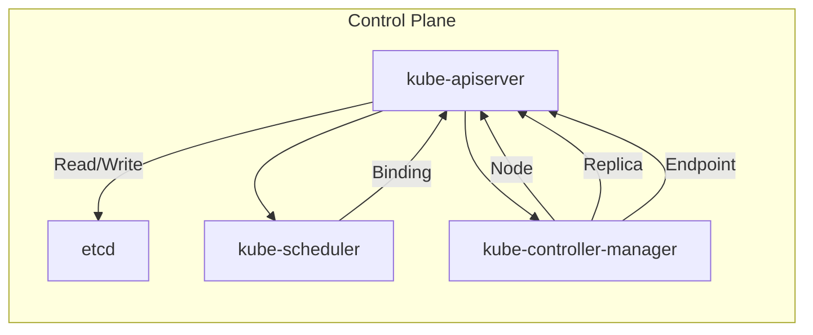
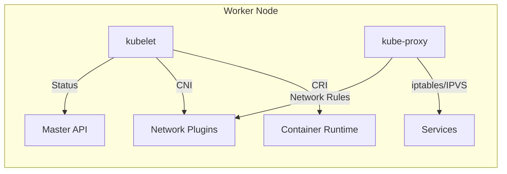
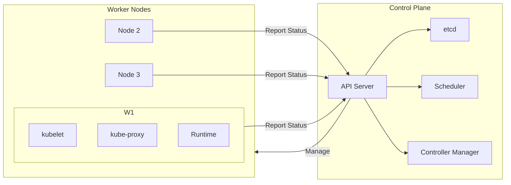
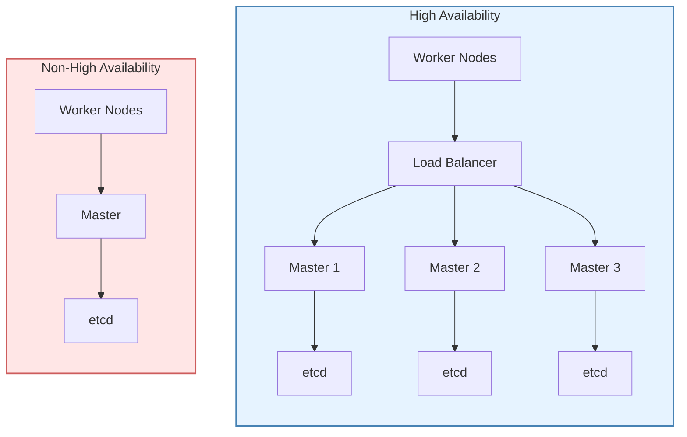
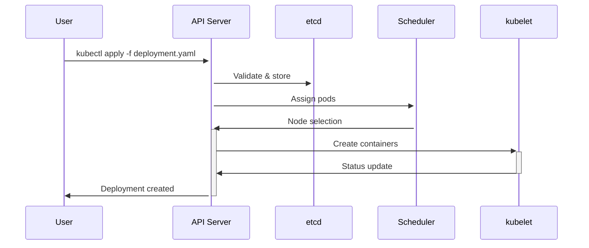

# Kubernetes Architecture and Components

## Overview
Kubernetes is a microservices-based container orchestration platform. When you install a Kubernetes cluster, even its core components run as containers. The architecture is designed to easily manage, scale, and deploy containerized applications.

## Cluster Components
A Kubernetes cluster consists of two main node types:

### 1. Control Plane (Master Nodes)
The "brain" of the cluster that manages overall operations.

#### Key Components:
- **kube-apiserver**  
  The cluster's REST API gateway that validates and processes all requests.
  - Responsibilities:
    - Request processing (create/delete/modify resources)
    - Authentication & authorization
    - Communicates with etcd
    - Provides cluster API interface

- **etcd**  
  Distributed key-value store that maintains cluster state.
  - Features:
    - Stores all cluster data (pods, nodes, configs)
    - Highly available when configured properly

- **kube-scheduler**  
  Assigns pods to nodes based on:
  - Resource requirements
  - Constraints/affinities
  - Node availability

- **kube-controller-manager**  
  Runs controller processes that regulate cluster state:
  - Node controller
  - Replication controller
  - Endpoints controller
  - Service account controller

- **cloud-controller-manager** (Optional)  
  Integrates with cloud provider APIs for:
  - Load balancers
  - Storage volumes
  - Node management


---
### 2. Worker Nodes
Nodes where application workloads actually run.

#### Key Components:
- **kubelet**  
 
  The primary node agent that:
  - Receives pod specs from API server
  - Manages container lifecycle
  - Reports node status

- **kube-proxy**  
 
  Manages network rules for:
  - Pod-to-pod communication
  - Service IP routing
  - Load balancing

- **Container Runtime**  
  (Docker, containerd, CRI-O) executes containers


---
### Combined Cluster Architecture

---

## Cluster Deployment Types

### 1. High Availability (HA)
- Multiple master nodes (typically 3 or 5)
- Automatic failover
- Suitable for production environments
- More complex setup
- Requires:
  - Load balancer
  - Shared etcd cluster
  - Persistent storage

### 2. Non-High Availability (Non-HA)
- Single master node
- Simple setup
- Single point of failure
- Recommended for:
  - Development/testing
  - Learning environments
  - Proof-of-concepts

### Deployment Comparison Diagram

---
### etcd Configuration Options

| Feature        | Internal etcd         | External etcd          |
|:--------------:|:---------------------:|:----------------------:|
| **Location**  | `Inside cluster`      | `Separate servers`     |
| **Management**| ✅ Kubernetes-managed | 🔧 Manual administration |
| **Scalability** | ⚠️ Limited         | 🚀 Highly scalable     |
| **Cost**      | 💰 Lower             | 💸 Higher              |
| **Best for**  | 🛠️ Development       | 🏭 Production          |
---
## API Server Deep Dive

The API server is the cluster's communication hub:

1. **Receives requests**  
   - Via `kubectl` commands, Through direct API calls  
   - From cluster components (controllers, scheduler)

2. **Validates authentication & authorization**  
   - Checks client certificates  
   - Verifies RBAC permissions  
   - Validates request headers

3. **Processes requests with other components**  
   - Coordinates with:  
     - Scheduler for pod placement  
     - Controller manager for state reconciliation  
     - kubelet for node operations

4. **Stores state in etcd**  
   - Persists all cluster state changes  
   - Maintains resource versions  

5. **Returns responses**  
   - Sends success/failure status  
   - Provides watch streams for changes  
   - Returns resource manifests
  
---
### Kubernetes Control Plane Sequence Diagram


---
### DNS in Kubernetes

#### Core Features
- **Built-in DNS service (CoreDNS)**  
  Default cluster DNS resolver running as a Pod in `kube-system` namespace. Replaces the legacy kube-dns.

- **Automatic service registration**  
  Services get DNS records automatically in the format:  
  `<service-name>.<namespace>.svc.cluster.local`

- **Stable network identities**  
  Provides:
  - ClusterIP stability (virtual IPs for Services)
  - Pod hostnames for StatefulSets (`<hostname>.<service-name>.svc.cluster.local`)

- **Service discovery via names**  
  Applications can reference services by name instead of IP addresses:
  ```bash
  # Inside a Pod, you can connect to:
  nginx-service.default.svc.cluster.local
  ```
  #### Example Flow

  ```mermaid
  sequenceDiagram
    Pod->>CoreDNS: What's the IP for nginx-service?
    CoreDNS->>kube-dns: Lookup request
    kube-dns->>API Server: Get Service info
    API Server-->>kube-dns: Service ClusterIP
    kube-dns-->>CoreDNS: DNS response
    CoreDNS-->>Pod: 10.96.123.45
  ```
