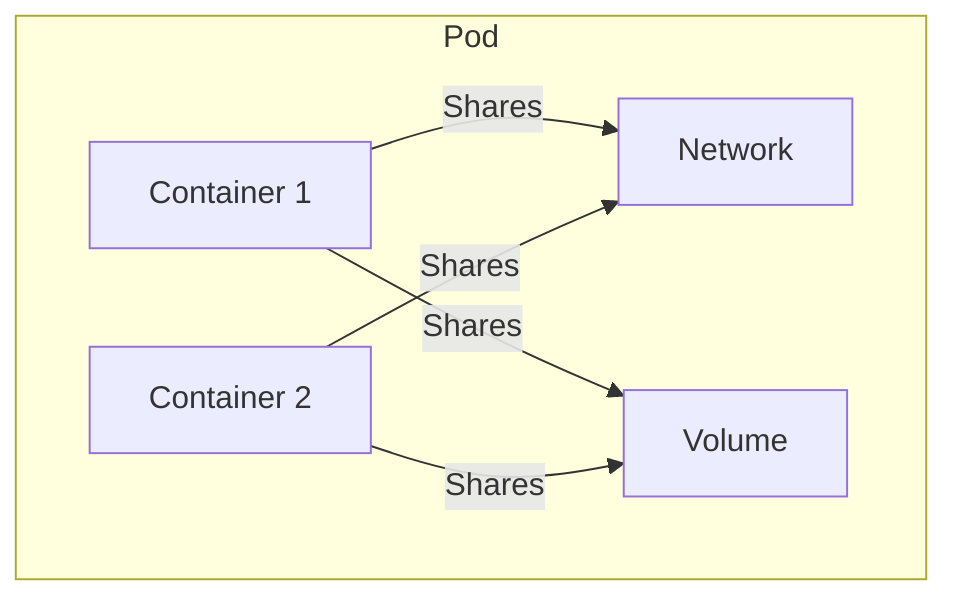
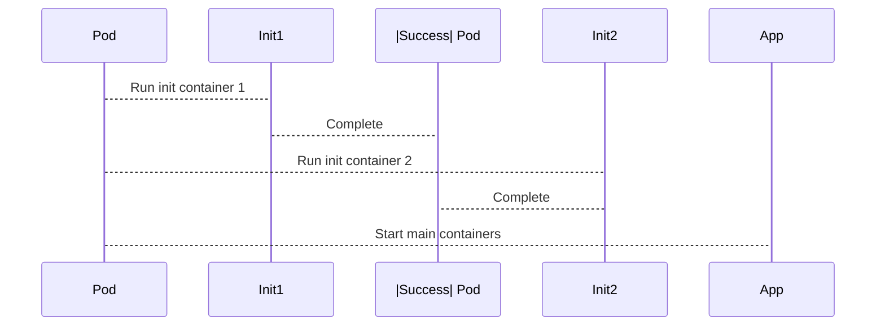
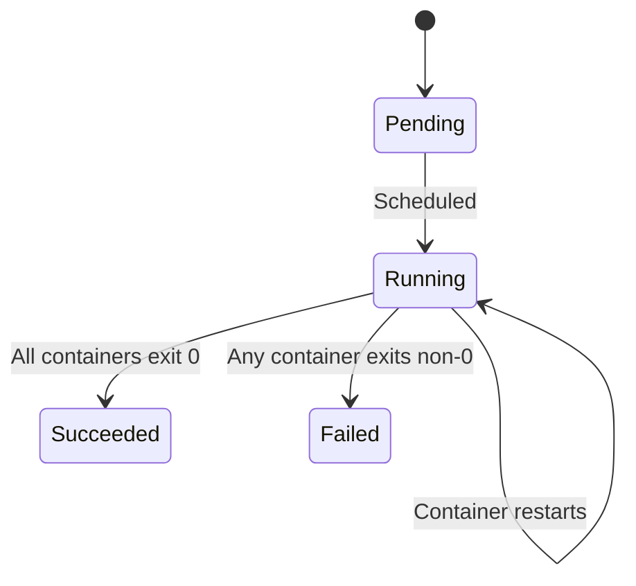
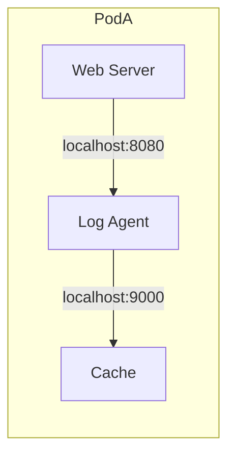

# Kubernetes Pods and Containers Deep Dive

## Pod Fundamentals
A Pod is the smallest deployable unit in Kubernetes - a logical "wrapper" that hosts one or more containers. Containers within a Pod share:
- Network namespace (same IP/port space)
- Storage volumes
- Linux namespaces (PID, UTS, IPC)


## Key Characteristics

| Feature            | Description                                      |
|--------------------|--------------------------------------------------|
| Shared Networking  | Containers communicate via localhost            |
| Shared Storage     | Volumes mounted to all containers               |
| Tight Coupling     | Designed for co-located, co-managed processes   |

## When to Use Multi-Container Pods

Ideal for:

- Sidecar patterns (logging, monitoring)
- Adapter patterns (data transformation)
- Ambassador patterns (proxy connections)

```yaml
apiVersion: v1
kind: Pod
metadata:
  name: web-server
spec:
  containers:
  - name: nginx
    image: nginx
  - name: log-sync
    image: fluentd
```
---

## Init Containers

Special containers that run before app containers to perform setup tasks.

### Common Use Cases:

- Database migrations
- Configuration downloads
- Dependency checks



### Example 

```yaml
spec:
  initContainers:
  - name: config-downloader
    image: busybox
    command: ['wget', 'https://configs/app.yaml', '-O', '/config/app.yaml']
  containers:
  - name: app
    image: my-app
    volumeMounts:
    - name: config
      mountPath: /config
```
---
## Pod Lifecycle

| Phase      | Description                              |
|------------|------------------------------------------|
| Pending    | Waiting for scheduling/resources        |
| Running    | Containers are operational              |
| Succeeded  | All containers exited successfully      |
| Failed     | At least one container terminated abnormally |
| Unknown    | State cannot be determined              |


---
## Kubernetes Pod & Container Status 

### Container States
| Status     | Meaning                          | Action Required               |
|------------|----------------------------------|--------------------------------|
| Waiting    | Not started (image pull, resources) | Check `Reason` field         |
| Running    | Active and healthy               | None (desired state)          |
| Terminated | Completed execution              | Check exit code (0=OK)        |

### Pod Conditions
| Condition       | Purpose                          |
|-----------------|----------------------------------|
| PodScheduled    | Node assignment status           |
| Initialized     | Init containers completed        |
| Ready           | Ready to serve traffic           |
| ContainersReady | All containers operational       |

### Troubleshooting Flow
1. Check Pod Phase (Pending/Running/Failed)
2. Inspect individual Container Statuses
3. Verify Pod Conditions for readiness
4. Check logs for `Waiting`/`Terminated` containers

> **Tip**: `kubectl describe pod <name>` shows all status details
---
## Kubernetes Restart Policies

Controls how Kubernetes handles container failures.

### Policy Options

| Policy      | Behavior                     | Use Case                          |
|-------------|------------------------------|-----------------------------------|
| `Always`    | Always restart container     | Long-running services (default)   |
| `OnFailure` | Restart only on failure      | Batch jobs                        |
| `Never`     | Never restart container      | One-time tasks                    |

### Configuration Example

```yaml
spec:
  restartPolicy: OnFailure  # Can be: Always, OnFailure, or Never
  containers:
  - name: batch-job
    image: job-image
```

### Key Notes

- **Default**: `Always` for Deployment-managed Pods  
  *(This is the default restart policy for Pods created by Deployments)*

- **Batch Jobs**: Typically use `OnFailure`  
  *(Ensures job retries on failure but stops after success)*

- **One-time Tasks**: Use `Never` for jobs that shouldn't restart  
  *(For tasks that should run exactly once, regardless of success/failure)*

- **Pod-Level Setting**:  
  Restart policy applies to *all containers* in the Pod  
  *(Cannot set different restart policies for different containers in the same Pod)*

- **Monitoring Tip**:  
  Use `kubectl describe pod <pod-name>` to view restart counts (`Restart Count` field)  
  Example:
  ```sh
  kubectl describe pod my-pod | grep "Restart Count"
  ```
  ---
  ## Network Communication in Pods

### Intra-Pod Communication (Same Pod)
Containers within the same Pod share the same network namespace:


### Key Characteristics:

- All containers share one IP address

- Communicate via localhost (no NAT)

- Ports must not conflict between containers

- Uses loopback interface (127.0.0.1)

```yaml
apiVersion: v1
kind: Pod
metadata:
  name: multi-container
spec:
  containers:
  - name: web
    image: nginx
    ports:
    - containerPort: 80
  - name: log-agent
    image: fluentd
    # Connects to nginx via localhost:80
```
### Inter-Pod Communication (Different Pods)
Pods communicate across the cluster using Kubernetes networking:
#### Methods:
##### 1. Pod IPs (Direct but ephemeral)
```bash
kubectl get pods -o wide  # Shows Pod IPs
```
#### 2.Services (Recommended):

  -  Stable ClusterIP (virtual IP)
  -  DNS resolution: service-name.namespace.svc.cluster.local

#### 3.Headless Services (Direct Pod access):
```yaml
kind: Service
spec:
  clusterIP: None # Creates DNS records for each Pod
```

###  Kubernetes Networking Models


| Model               | How It Works                  | When To Use                  |
|---------------------|-------------------------------|------------------------------|
| **Same-Pod**        | `localhost` communication     | Sidecar containers           |
| **Pod-to-Pod**      | CNI-provided cluster network  | Direct Pod communication     |
| **Pod-to-Service**  | kube-proxy virtual IP         | Service discovery           |
| **External Access** | Ingress/LoadBalancer          | Public-facing services      |

#### Key Points

- **Same-Pod Comms**: Fastest (localhost), shared network namespace
- **Cluster Networking**: 
  - Requires CNI plugin (Calico/Flannel)
  - Pods get unique cluster IPs
- **Services**:
  - Stable endpoints for dynamic Pods
  - Automatic load balancing
- **External Access**:
  - LoadBalancer: Cloud-native external IP
  - Ingress: HTTP/S routing
  - NodePort: Direct node access

> **Pro Tip**: Use `kubectl get endpoints` to verify Service-to-Pod mappings
```bash
# Check DNS resolution
kubectl exec -it mypod -- nslookup redis-service

# Test connectivity
kubectl exec -it mypod -- curl http://backend:8080
```
---


